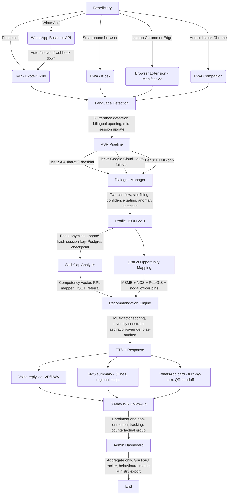

# PM-AJAY AI-Powered Multilingual Voice Livelihood Assistant
## Comprehensive Implementation Plan - Version 2.0 (Hardened)

**Scheme:** Pradhan Mantri Anusuchit Jaati Abhyuday Yojana (PM-AJAY) - Grant-in-Aid (GIA) Component 
**Solution:** AI-driven multilingual voice-based virtual livelihood assistant 
**Pilot Target:** Pune District, Maharashtra (Marathi + Hindi, 50-100 beneficiaries) 
**Team Size:** 6 persons 
**Plan Version:** 2.0 - all 23 vulnerabilities from the security audit are resolved in this version, including one new addition (C7) for the browser companion channel 

---

## Table of Contents

- [1. Executive Summary](#1-executive-summary)
- [2. Resolved Vulnerabilities - Change Log](#2-resolved-vulnerabilities---change-log)
- [3. Part 1 - Frontend](#3-part-1---frontend)
   - [Phase F1 - Voice & Speech Interface](#phase-f1---voice-speech-interface)
   - [Phase F2 - Conversational UI & Dialogue Design](#phase-f2---conversational-ui-dialogue-design)
   - [Phase F3 - Accessibility & Low-tech UX](#phase-f3---accessibility-low-tech-ux)
- [4. Part 2 - Backend](#4-part-2---backend)
   - [Phase B1 - Data Architecture & NSQF Database](#phase-b1---data-architecture-nsqf-database)
   - [Phase B2 - AI/ML Profiling & Recommendation Engine](#phase-b2---aiml-profiling-recommendation-engine)
   - [Phase B3 - APIs, Security & Admin Dashboard](#phase-b3---apis-security-admin-dashboard)
- [5. Part 3 - Integration](#5-part-3---integration)
   - [Phase I1 - Channel Integration](#phase-i1---channel-integration)
   - [Phase I2 - End-to-end Testing & QA](#phase-i2---end-to-end-testing-qa)
   - [Phase I3 - Pilot Deployment & Scale](#phase-i3---pilot-deployment-scale)
- [6. Consolidated Timeline - 8 Weeks](#6-consolidated-timeline---8-weeks)
- [7. Team Responsibilities](#7-team-responsibilities)
- [8. Architecture Overview](#8-architecture-overview)
- [9. Risk Register - Residual Risks After Mitigations](#9-risk-register---residual-risks-after-mitigations)
- [10. Known Implementation Risks (Pre-Build Watch List)](#10-known-implementation-risks-pre-build-watch-list)
- [11. Database Preparation Checklist (PostgreSQL + Redis)](#11-database-preparation-checklist-postgresql-redis)
- [12. References](#12-references)

---

## 1. Executive Summary

The PM-AJAY GIA component suffers from five structural problems that drive poor outcomes:

| GIA Problem | Root Cause | This System's Response |
|---|---|---|
| High training dropout | Mismatch between course and beneficiary interest, capability, and geography | AI profiling + NSQF matching with aspiration-override |
| Poor placement rates | Training not aligned with local job market demand | District-level opportunity mapping + demand-weighted scoring |
| Planning roadmap gap | No beneficiary data before enrolment | Voice interview -> structured profile -> GIA perspective plan dashboard |
| Ministry coordination failures | No shared real-time visibility | Admin dashboard with district-level RAG status and Ministry export |
| Inadequate ground support | CSC operators under-equipped | Certified operator training, operator-assisted session flagging, escalation helpline |

The system collects beneficiary profiles through empathetic voice conversations in regional languages (no text required), analyses them against NSQF-aligned courses and local economic data, and delivers personalised livelihood recommendations via IVR, WhatsApp, SMS, PWA, kiosk, or a lightweight **browser companion (extension/side-panel)** - whichever channel the beneficiary, CSC operator, or district official can access, on a laptop or an Android phone.

**Version 2.0 specifically addresses:** biased recommendation logic, unsafe session-resume design, caste data privacy exposure, over-reliance on WhatsApp as a primary channel, stale training-centre data, insufficient ASR accuracy standards, IVR completion rate optimism, model retraining survivorship bias, consent process fragility, and ten further risks identified in the vulnerability audit.

**Version 2.0 also adds a browser-based companion channel** so the assistant can sit alongside a CSC operator or nodal officer's normal browsing - as a Chrome extension on a laptop, and as an equivalent lightweight web-based companion on Android - without requiring anyone to own a PC. See C7 below and Phase F3.3.

---

## 2. Resolved Vulnerabilities - Change Log

This section documents every vulnerability from the audit and the specific change made to address it in this plan.

### Critical Fixes

**C1 - ASR WER threshold too lenient** 
*Old:* Single WER <20% target applied uniformly. 
*Fixed:* Per-slot WER targets enforced. Geographic and occupation slots require WER <8%. Confidence-gated extraction: if ASR confidence <0.75 for a critical slot, system re-prompts or switches to DTMF confirmation. Out-of-vocabulary detection: if a transcribed district name does not match any LGD district code, the system rejects it and asks again. See F1.1.

**C2 - Recommendation bias against SC women** 
*Old:* Scoring model trained on historical enrolment data with no bias controls. 
*Fixed:* Pre-launch audit of recommendation distribution by gender and caste sub-group. Diversity constraint added: top-3 recommendations must span at least two distinct SSC sectors. Aspiration-override flag: if beneficiary's stated interest diverges from model's top pick, the aspiration-aligned option is always shown alongside. See B2.2.

**C3 - Caste and economic data as surveillance target** 
*Old:* Profile stored as a single linked record; admin dashboard shows individual records. 
*Fixed:* Pseudonymisation from day one: profile ID decoupled from phone number via one-way hash in a separate access-controlled table. DPIA conducted before any data collection. Admin dashboard shows aggregate statistics only; individual records require supervisor-approved audit log entry. Breach response plan documented. See B3.1.

**C4 - Session resume PIN unusable for low-literacy users** 
*Old:* Beneficiary given a PIN to write down and re-enter. 
*Fixed:* Phone number is the session key. No PIN. When the same number calls back within 48 hours, session resumes automatically from the last confirmed slot, with a voice confirmation: "Last time you told me you live in Pune and you studied to Class 8. Is that still correct?" See F2.1.

**C5 - WhatsApp API gives Meta veto power over a welfare service** 
*Old:* WhatsApp designated as primary smartphone channel. 
*Fixed:* WhatsApp redesignated as supplementary convenience layer. IVR + PWA are the primary channels. If WhatsApp webhook fails, new beneficiaries are automatically routed to IVR. A government-operated RCS or Bhashini messaging integration is evaluated as a WhatsApp replacement for the national scale phase. See I1.1.

**C6 - Stale training-centre data destroys trust** 
*Old:* Quarterly update pipeline from government data dumps. 
*Fixed:* "Last verified" date added to every centre record; centres not verified in 30 days are greyed out. Integration with PMKVY's live centre portal API replaces quarterly dumps. Ground-truth layer: CSC operators can mark a centre as "unresponsive" from the admin dashboard. Every recommendation includes the training centre's phone number, confirmed reachable before dispatch. See B1.1.

**C7 - Browser-based companion must not exclude beneficiaries without a PC** 
*Old:* No browser-extension channel existed; any laptop-only tool would silently exclude the majority of beneficiaries, who only have an Android phone. 
*Fixed:* The companion is built once as a Manifest V3 Chrome/Edge extension (laptop/desktop Chrome) and, because **stock Android Chrome does not support desktop extensions at all** - this is a deliberate Google security/performance restriction, not a missing setting - the same experience is shipped to Android as a **PWA-based browser companion** (installable via "Add to Home Screen," works in stock Chrome on Android, no third-party browser and no sideloading required). No CSC operator, nodal officer, or beneficiary is required to install an unofficial/modified Chrome APK or a third-party browser. See F3.3.

### High-Severity Fixes

**H1 - ASR trained on literary, not rural Marathi** 
*Fixed:* 20-30 hours of rural Marathi audio collected at pilot camps for IndicWhisper fine-tuning. Dialect-tagged ASR evaluation set built; WER reported separately by dialect, not as a single average. See F1.1.

**H2 - IVR completion rate target too optimistic** 
*Fixed:* Interview split into two calls: Call 1 (mandatory, ~4 minutes) collects 4 critical slots and delivers a partial recommendation. Call 2 (optional, ~4 minutes, scheduled by the beneficiary) collects the remaining 4 slots and refines the recommendation. Incentive: "Call back for a more specific result." 5-person rapid usability test conducted before pilot to measure real drop-off by slot. See F3.2.

**H3 - Cold start problem for new districts** 
*Fixed:* District economic profiles pre-populated from MSME census, Annual Survey of Industries, and state employment exchange data before any job-posting data is available. District nodal officer can pin 3-5 locally relevant courses before the model has enough data to rank them. See B1.2.

**H4 - RPL pathway with no handoff mechanism** 
*Fixed:* Every RPL recommendation includes the SSC assessment coordinator's phone number for the relevant sector in that district. A referral workflow sends the beneficiary's profile summary to the district RSETI counsellor for manual RPL follow-up. See B2.1.

**H5 - Redis session store is a single point of failure** 
*Fixed:* Redis Sentinel deployed for automatic failover. Session checkpoints persisted to the primary PostgreSQL database every 2 minutes; Redis is now a cache, not the source of truth. See I1.1.

**H6 - CSC operator quality underprepared** 
*Fixed:* 30-minute operator training video with a certification quiz; kiosk is not activated until the operator passes. All operator-assisted sessions flagged in the data pipeline and excluded from model retraining unless manually validated by a supervisor. "Was this session assisted?" field added to session metadata, set automatically in operator-facing kiosk mode. See I1.2 and I3.1.

**H7 - Consent legally thin in practice** 
*Fixed:* Consent split into two moments. At session start: one sentence ("Your answers help us find the right training for you. We do not share them outside the government.") followed by "Press 1 to agree, Press 2 to hear more." Full DPDPA-compliant notice available on request. Consent script reviewed by a DPDPA-qualified legal advisor before deployment. See F2.1.

**H8 - Model retraining survivorship bias** 
*Fixed:* Non-enrolment tracked as an explicit outcome: IVR follow-up 30 days post-recommendation asks "Did you join the course? Press 1 for yes, 2 for no." Counterfactual evaluation set: 10% of pilot beneficiaries receive a randomised recommendation to measure model-vs-chance lift. See I3.2.

**H9 - No adversarial or fraud testing** 
*Fixed:* Voice interview treats profiling as advisory only, never as eligibility verification. Aadhaar/DigiLocker verification required before any GIA benefit is unlocked - kept strictly outside this system's scope with a documented API handoff. Anomaly flag: if a beneficiary's education or occupation changes substantially between sessions, the profile is flagged for human review. See B3.1.

### Medium-Severity Fixes

**M1 - Language detection fails on code-mixed opening utterances** 
*Fixed:* Language detected from the first 3 utterances combined. All sessions open with a bilingual greeting; beneficiary's response drives language selection. Language updated mid-session if detection confidence improves. See F1.1.

**M2 - NIC cloud / data localisation requirement** 
*Fixed:* All backend services containerised with Docker and Kubernetes from day one. Infrastructure code is cloud-agnostic (Terraform); NIC MeghRaj is a configuration change, not a rewrite. Deployment environment confirmed with Ministry stakeholders in Week 1. See B3.1.

**M3 - Counsellor-rated relevance metric is gameable** 
*Fixed:* Primary quality metric replaced with a behavioural proxy: did the beneficiary contact the training centre within 7 days? Secondary metric: 30-day IVR follow-up call. Counsellor rating retained as a supplementary signal only. See I3.2.

**M4 - No ASR fallback if Bhashini is down** 
*Fixed:* Two-tier ASR stack: AI4Bharat/Bhashini as primary; Google Cloud Speech-to-Text (Marathi + Hindi supported) as hot standby with automatic failover. For IVR, pure DTMF fallback mode implemented: all questions have a numeric answer option so sessions can complete with no ASR. See I1.1.

**M5 - NSQF database scraping will hit barriers** 
*Fixed:* Official data access requested from NCVET/NSDC through SIH sponsorship in Week 1. NCVET downloadable QP Excel files used as primary bootstrap. Scraping retained as a fallback and for incremental updates only. See B1.1.

**M6 - WhatsApp voice note fragmentation** 
*Fixed:* WhatsApp flow redesigned as turn-by-turn: one question sent, one answer received. No reliance on long voice notes. Message sequence numbering and deduplication added using WhatsApp message IDs. See I1.1.

**M7 - Scale roadmap assumes language swap equals full expansion** 
*Fixed:* Each state expansion treated as a new ethnographic research phase with new dialogue scripts, new local opportunity data, and new ground partners. Tamil Nadu community partner engaged from Month 3 of the Maharashtra pilot. See I3.2.

---

## 3. Part 1 - Frontend

**Owns:** The beneficiary-facing layer - voice interaction, multilingual speech processing, accessible dialogue, and multi-channel delivery. 
**Primary owners:** Person 2 (Speech AI), Person 3 (Dialogue & NLU), Person 6 (Channels & UX).

---

### Phase F1 - Voice & Speech Interface

**Weeks 1-3**

#### Sub-phase F1.1 - ASR Engine Setup & Language Architecture (HARDENED)

Build the speech-to-text pipeline using AI4Bharat's IndicWhisper and IndicConformer models, structured around a location-first language hierarchy: State -> District -> Mother Tongue -> Speech Variety -> ASR Model, as specified in the Research Addendum.

**Key design decision (from C1 fix):** A single WER target is replaced with per-slot targets. This is the most important change from v1.0.

**Tasks:**

- Integrate AI4Bharat IndicWhisper and Bhashini ASR endpoints as the primary ASR layer for Marathi and Hindi
- Configure Google Cloud Speech-to-Text (Marathi + Hindi) as a hot standby; implement automatic failover if Bhashini returns 3 consecutive errors or latency exceeds 6 seconds (M4 fix)
- For IVR sessions, implement DTMF-only fallback mode: all questions have numeric answer options so a session can complete even with zero ASR (M4 fix)
- Build a language selection module backed by Census C-16 mother-tongue data for each deployment district
- Implement bilingual opening greeting: "Namaskar! Aamhi Marathi madhye bolto ka? / Namaskar! Kya hum Hindi mein baat karein?" - detect language from the beneficiary's response, not from a menu selection (M1 fix)
- Detect language from the first 3 utterances combined; update language mid-session if detection confidence improves above 0.85 (M1 fix)
- Handle code-mixed speech (Hinglish, Marathinglish) using IndicNLP transliteration layers
- Build audio preprocessing pipeline: noise reduction, normalisation, compression for low-bandwidth environments
- Collect 20-30 hours of rural Marathi audio at the first camp events for IndicWhisper fine-tuning (H1 fix)
- Build a dialect-tagged ASR evaluation set covering Nashik Marathi, Vidarbha Marathi, and Varhadi; report WER separately by dialect, not as a single average (H1 fix)

**Per-slot WER targets (C1 fix):**

| Slot | WER Target | Fallback if not met |
|---|---|---|
| District / taluka name | <8% | LGD code validation + re-prompt |
| Occupation / trade name | <8% | NSQF taxonomy OOV detection + re-prompt |
| Education level | <12% | DTMF numeric confirmation |
| Spoken language | <5% | Bilingual opening handles this |
| Mobility / physical constraints | <15% | Simple yes/no DTMF confirmation |
| Interest and aspiration | <20% | Acceptable - open-ended slot |

**Confidence gating (C1 fix):** If ASR confidence <0.75 for any critical slot (district, occupation), the system re-prompts once using a narrower question, then switches to DTMF confirmation if confidence is still insufficient.

**Out-of-vocabulary detection (C1 fix):** Transcribed district names validated against Census LGD district code list. If no match within edit distance 2, the system asks again: "I didn't catch that clearly - which district are you from?"

**Deliverables:**
- ASR module (audio in -> transcript out) with two-tier fallback
- Language detection service (bilingual opening, 3-utterance detection)
- Per-slot confidence gating layer
- Preprocessing pipeline (noise reduction, compression)
- DTMF fallback mode for IVR
- Dialect-tagged evaluation corpus and per-dialect WER report

---

#### Sub-phase F1.2 - TTS Engine & Empathetic Voice Output

Build the text-to-speech layer that converts assistant responses into natural-sounding regional-language audio. The voice must feel like a community facilitator, not a government IVR.

**Tasks:**

- Integrate AI4Bharat IndicTTS for Marathi and Hindi with natural prosody; default to a female voice for approachability based on community feedback from pilot planning
- Design voice persona: warm, mid-paced, pause-aware, with affirmation phrases (haan, achha, theek hai, barobar) between questions
- Implement adaptive speech rate: deliberately slow for first-time users (wpm reduced by 20%), slightly faster on sessions where the beneficiary has responded quickly
- Generate pre-rendered audio chunks for the 50 most frequently used phrases to reduce TTS latency below 1 second on low-bandwidth networks
- Implement real-time TTS for dynamic response elements: names, training-centre addresses, recommended course titles, distances in kilometres
- Add confirmation echo before advancing to the next slot: "You said [answer]. Is that correct? Press 1 for yes, 2 to try again."

**Deliverables:**
- TTS module (text in -> regional-language audio out)
- Voice persona specification document
- Pre-rendered audio phrase library (50+ phrases)
- Confirmation echo system

---

### Phase F2 - Conversational UI & Dialogue Design

**Weeks 2-4**

#### Sub-phase F2.1 - Empathetic Interview Flow & Session Management (HARDENED)

Design the interview conversation that replaces form-filling. The flow collects eight beneficiary profile dimensions through natural dialogue, building rapport before sensitive questions.

**Consent redesign (H7 fix):**

The consent process is split into two moments to be both legally compliant and practically usable:

- *Moment 1 (mandatory):* One sentence, read aloud: "Your answers help us find the right training for you. We do not share them with anyone outside the government." Followed by: "Press 1 if you agree to continue, Press 2 to hear more about how your data is used." Session does not proceed until 1 is pressed.
- *Moment 2 (on request):* Full DPDPA-compliant notice available on request, read aloud in full, followed by another confirmation. Consent script reviewed and signed off by a DPDPA-qualified legal advisor before deployment.

**Session resume without PIN (C4 fix):**

Phone number is the session key. No PIN is ever issued or required.

- When a number calls back within 48 hours of an incomplete session, the system automatically resumes from the last confirmed slot
- Resume opens with a voice confirmation: "Last time you told me you live in [district] and you studied up to [education level]. Is that still correct? Press 1 for yes, 2 if something has changed."
- For WhatsApp, the thread itself is the session identifier - native to the platform

**Two-call interview structure (H2 fix):**

The interview is split to improve IVR completion rates from a realistic 35-40% to a target 65%+:

- *Call 1 (mandatory, ~4 minutes):* Collects district, education level, primary occupation or interest, and spoken language. Delivers a partial recommendation at the end: "Based on what you've told me, here are two courses that might suit you. Call back to get a more specific result."
- *Call 2 (optional, scheduled, ~4 minutes):* Beneficiary schedules this themselves at the end of Call 1 ("Press 1 for me to call you back tomorrow morning"). Collects remaining slots: mobility constraints, self/wage preference, family occupation, nearby market access.

**Eight profile slots:**

| Slot | Call | Method | Validation |
|---|---|---|---|
| District / taluka | 1 | Open speech | LGD code match |
| Education level | 1 | Open speech + DTMF confirm | Grade code mapping |
| Primary interest or occupation | 1 | Open speech | NSQF taxonomy match |
| Spoken language(s) | 1 | Auto-detected + confirm | Language code |
| Mobility or physical constraints | 2 | Yes/No DTMF | - |
| Self-employment vs wage preference | 2 | DTMF 1/2 | - |
| Family or traditional occupation | 2 | Open speech | NSQF RPL taxonomy |
| Nearest town or market | 2 | Open speech | LGD match |

**Tasks:**

- Write dialogue script in Marathi and Hindi with local idioms; test with at least 3 native speakers before pilot
- Build LLM-based slot-filling dialogue manager (Claude API or open Indic LLM) with graceful recovery for unclear answers
- Implement follow-up clarification: if an answer is ambiguous, ask one targeted follow-up before moving on; never ask the same question more than twice
- Handle interruptions, silence, and background noise: re-prompt once, then offer DTMF fallback
- Define minimum viable profile: 4 mandatory slots from Call 1 are sufficient to generate a partial recommendation

**Deliverables:**
- Dialogue script (Marathi + Hindi) with consent redesign
- Slot-filling dialogue manager
- Two-call flow with call-back scheduling
- Phone-number-based session resume (no PIN)
- DPDPA legal review sign-off on consent script

---

#### Sub-phase F2.2 - Named Entity Extraction & Structured Profile Generation

Convert free-form voice answers into a structured beneficiary profile JSON for downstream processing.

**Anomaly detection (H9 fix):**

The profile generation layer includes an anomaly flag: if a beneficiary's education level or primary occupation changes by more than one NSQF level between two sessions (e.g., "no schooling" to "graduate"), the profile is flagged for human review before the recommendation is generated.

**Tasks:**

- Build NER layer using AI4Bharat IndicNLP to extract occupation names, skill terms, and place names from Marathi and Hindi speech
- Map extracted occupation terms to NSQF job-role taxonomy and SSC sector categories
- Map spoken education levels (aathvee paas, dus tak padhe) to standardised grade-level codes
- Normalise district and taluka names against Census LGD codes
- Generate profile JSON with a confidence score per slot; flag slots below 0.75 confidence for re-collection or human review
- Implement anomaly detection for cross-session inconsistencies (H9 fix)
- Store session checkpoints to PostgreSQL every 2 minutes for call-drop resilience (H5 fix)

**Profile JSON schema v2.0:**

```json
{
 "session_id": "uuid",
 "phone_hash": "sha256_one_way_hash",
 "call_number": 1,
 "language_detected": "mr",
 "dialect_tag": "nashik_marathi",
 "district_lgd": "523",
 "district_name": "Pune",
 "education_grade": 8,
 "education_confidence": 0.91,
 "primary_interest": "tailoring",
 "nsqf_interest_code": "SCM/Q0301",
 "family_occupation": "agricultural_labour",
 "rpl_eligible": true,
 "mobility_constraint": false,
 "preference": "self_employment",
 "nearest_market": "Hadapsar",
 "assisted_session": false,
 "operator_id": null,
 "consent_given": true,
 "consent_timestamp": "2025-11-12T09:23:11Z",
 "anomaly_flag": false,
 "slot_confidence": { "district": 0.95, "education": 0.91, "interest": 0.83 }
}
```

**Deliverables:**
- NER pipeline for Marathi and Hindi
- NSQF and LGD term mappers
- Profile JSON schema v2.0 with confidence scores and anomaly flag
- Session checkpoint persistence layer

---

### Phase F3 - Accessibility & Low-tech UX

**Weeks 3-5**

#### Sub-phase F3.1 - Progressive Web App & Kiosk Interface

Build the visual interface for smartphone and CSC kiosk access.

**Operator training integration (H6 fix):**

The kiosk has two modes:

- *Self-service mode:* Beneficiary operates the kiosk unaided. Default for returning users or users who have used the IVR before.
- *Operator-assisted mode:* Operator helps the beneficiary navigate the interview. This mode is clearly flagged in the session metadata (`"assisted_session": true`). Operator must enter their certified operator ID before assisted mode activates.

Kiosk is not activated at a new CSC location until the operator has completed the 30-minute training video and passed the certification quiz (score >=80%).

**Tasks:**

- Build offline-first PWA using service workers; all audio prompts and UI assets cached locally; minimum 48 hours offline operation
- Design voice-first layout: single large microphone button, no required text reading
- All navigation labels paired with illustrative icons (school building = education, tools = skills, location pin = district, phone = call)
- Support portrait mobile (360px) through to kiosk tablet (1024px)
- Progress indicator: five coloured circles, filled as each topic block completes (no numbers - numbers imply literacy)
- Operator-assisted mode toggle with operator ID entry and automatic session tagging (H6 fix)
- End-screen recommendation card: training centre name, distance in kilometres, phone number (tappable to call), QR code linking to WhatsApp confirmation message
- Auto-logout after 3-minute inactivity in kiosk mode

**Deliverables:**
- Offline-first PWA (360px-1024px responsive)
- Operator certification quiz module
- Two-mode kiosk interface (self-service and assisted)
- Recommendation display card with tap-to-call

---

#### Sub-phase F3.3 - Browser Companion: Laptop Extension + Android Equivalent (NEW, C7 fix)

Package the same assistant logic as a lightweight browser companion so CSC operators, district officials, and smartphone-only beneficiaries can trigger it from any webpage (e.g. the PMKVY portal or the admin dashboard) - on a laptop **and** on an Android phone - without assuming either device is a PC.

**Design constraint acknowledged up front:** stock Google Chrome for Android does not support desktop-style extensions at all. This is a deliberate Google restriction (security, performance, and battery reasons), not a missing setting, so the plan ships two builds from one shared codebase rather than promising a single "Chrome extension" that runs everywhere:

| Platform | What ships | Why |
|---|---|---|
| Windows/Mac/Linux Chrome or Edge (laptop) | Manifest V3 browser extension, listed on the Chrome Web Store | Full, officially supported extension APIs |
| Android - stock Chrome | Installable PWA companion (same UI shell as F3.1), added to the home screen, opens as a compact overlay | Stock Chrome cannot load desktop extensions; the PWA is the only channel Google fully supports there |

**Tasks:**

- Build the companion's core logic (voice trigger, profile lookup, recommendation card, escalation button) as a shared module compiled into both the Manifest V3 extension and the PWA companion, so business logic is written once
- Laptop extension: content-script overlay plus a Chrome Side Panel so an operator can pull up a beneficiary's profile while on the PMKVY or admin-dashboard page
- Android PWA companion: the same panel UI reflowed as a bottom sheet, installable via "Add to Home Screen," with no Play Store review dependency and no PC required
- Publish the extension to the Chrome Web Store under official SIH/Ministry branding
- Explicitly exclude modified/sideloaded Chrome APKs or third-party browsers claiming to "unlock" extensions from all operator guidance, and flag them as a security anti-pattern in operator training
- Feature-detect on load: if the runtime doesn't support the needed extension APIs (e.g. stock Android Chrome), redirect automatically to the PWA companion instead of failing silently
- Share the phone-number session key (C4) across the laptop extension, Android PWA companion, IVR, and kiosk, so a beneficiary or operator moving between devices keeps one continuous profile

**Deliverables:**
- Manifest V3 browser extension (Chrome Web Store, laptop/desktop)
- Android PWA companion sharing the same core logic and UI shell
- Feature-detection/redirect layer between the two builds
- Chrome Web Store listing and store-review checklist

---

#### Sub-phase F3.2 - WhatsApp Supplementary Channel & IVR (HARDENED)

**WhatsApp redesignated as supplementary (C5 fix):**

WhatsApp is no longer a primary channel. It is a convenience layer for beneficiaries who already use WhatsApp and would find it easier than calling. If the WhatsApp webhook fails, new beneficiaries are automatically routed to IVR. The system works fully without WhatsApp.

**Turn-by-turn WhatsApp design (M6 fix):**

The WhatsApp flow sends one question at a time and receives one answer at a time. No long voice notes. Message sequence numbers and WhatsApp message IDs used for deduplication.

**Two-call IVR (H2 fix):**

IVR is restructured around the two-call architecture from F2.1. Call 1 is 4 minutes; Call 2 is optional and scheduled by the beneficiary.

**Tasks:**

- Configure Exotel or Twilio IVR with a toll-free number; route inbound calls to the two-call dialogue flow
- Implement turn-by-turn WhatsApp Business API flow: question sent as text message + voice note; answer received as voice note or text; ASR applied to voice answers
- Add deduplication logic using WhatsApp message IDs to handle re-sent messages (M6 fix)
- Session continuity: IVR and WhatsApp sessions for the same phone number share the same session state in PostgreSQL
- SMS summary at session end: 3-line text in regional script - course name, centre name and distance, centre phone number
- If WhatsApp webhook fails for more than 2 minutes, new beneficiaries automatically redirected to IVR (C5 fix)
- Evaluate government-operated RCS or Bhashini messaging as a WhatsApp replacement for national scale, document findings by end of pilot (C5 fix)
- Toll-free helpline for beneficiaries who need a human counsellor after the automated session

**Deliverables:**
- IVR two-call flow (Exotel/Twilio)
- WhatsApp turn-by-turn webhook flow (supplementary)
- WhatsApp-to-IVR automatic failover
- SMS summary (regional script)
- RCS/Bhashini evaluation report
- Toll-free helpline integration

---

## 4. Part 2 - Backend

**Owns:** Data, AI/ML, APIs, security, and admin tooling. 
**Primary owners:** Person 4 (ML/Recommendation), Person 5 (Data & Backend), Person 1 (Architecture & Integration).

---

### Phase B1 - Data Architecture & NSQF Database

**Weeks 1-3**

#### Sub-phase B1.1 - NSQF Course, QP & SSC Database (HARDENED)

Build the core knowledge base powering recommendations.

**Official data access first (M5 fix):**

In Week 1, Person 1 requests official NCVET/NSDC data access through the SIH sponsorship relationship. NCVET's downloadable QP Excel files are used as the primary bootstrap data source. Scraping is retained only as a fallback for incremental updates.

**Live centre verification (C6 fix):**

The training-centre sub-table includes a `last_verified` date and a `status` field (`active`, `unresponsive`, `closed`). Centres with `last_verified` more than 30 days ago are greyed out in recommendations. CSC operators can mark a centre as `unresponsive` from the admin dashboard. Every recommendation includes the centre's phone number, confirmed reachable (automated ping or operator confirmation) before dispatch.

**Tasks:**

- Request official NCVET/NSDC data access in Week 1; bootstrap from downloadable QP Excel files (M5 fix)
- Ingest NCVET QP catalogue: 3,000+ QPs with sector, NSQF level, duration, entry requirements, learning outcomes
- Map each QP to its governing SSC and flag QPs under PMKVY, PM-AJAY GIA, NSFDC, Stand-Up India, Mudra for preferential ranking
- Index entry requirements per QP: minimum education, literacy level, physical requirements, SC-reservation quotas
- Build training-centre sub-table with GPS coordinates, seat capacity, batch schedule, course codes, phone number, and `last_verified` date (C6 fix)
- Integrate with PMKVY's live centre portal API for real-time status; fall back to quarterly download if API unavailable (C6 fix)
- Add ground-truth update endpoint: CSC operators can mark a centre as unresponsive within 24 hours of a failed beneficiary visit (C6 fix)
- Build quarterly update pipeline for QP data; weekly refresh for training-centre status

**Deliverables:**
- NSQF QP database (3,000+ QPs, NCVET-sourced)
- SSC mapping table
- Training-centre index with live status, phone number, and verification date
- PMKVY live API integration
- Operator centre-status update endpoint

---

#### Sub-phase B1.2 - District-level Opportunity & Labour Market Mapping (HARDENED)

**Pre-populate before pilot launch (H3 fix):**

District economic profiles are pre-populated from MSME census data, Annual Survey of Industries, and state employment exchange records before the pilot begins - not bootstrapped from job postings alone, which will not be available for new districts.

**District nodal officer override (H3 fix):**

The admin dashboard includes a "local context" field editable by the district nodal officer: they can pin 3-5 locally relevant courses before the model has enough data to rank them. Pinned courses are shown prominently with the label "Recommended by your district office."

**Tasks:**

- Pre-populate district economic profiles for all Maharashtra districts using MSME census data, Annual Survey of Industries (ASI), and state employment exchange records (H3 fix)
- Map traditional SC occupations by district using Scheduled Caste sub-plan data and Census occupation tables (C-7, C-19)
- Aggregate NCS job postings by district and sector; refreshed weekly
- Tag each district with top-5 employable skills based on industry presence and job-posting frequency
- Add MUDRA/Stand-Up India self-employment data: most common loan categories approved by district
- Build geospatial index (PostGIS): given beneficiary LGD district code, return closest training centre offering required QP, with distance in kilometres
- Implement district nodal officer "local context" override for pinned courses (H3 fix)

**Deliverables:**
- District economic profiles (all Maharashtra districts)
- NCS job-posting weekly feed integration
- PostGIS geospatial centre query
- District nodal officer course-pinning interface
- MUDRA self-employment opportunity dataset

---

### Phase B2 - AI/ML Profiling & Recommendation Engine

**Weeks 2-5**

#### Sub-phase B2.1 - Beneficiary Profiling & Skill-Gap Analysis (HARDENED)

**RPL handoff mechanism (H4 fix):**

Every RPL recommendation includes the SSC assessment coordinator's phone number for the relevant sector in the beneficiary's district. A referral workflow automatically sends the beneficiary's profile summary to the district RSETI counsellor for manual follow-up within 48 hours.

**Tasks:**

- Build competency vector per beneficiary: map stated skills and occupational experience to NSQF competency unit codes
- Cross-reference competency vector against QP entry requirements to identify skill gaps per candidate course
- Classify gap severity: Zero gap (enrolment-ready), Partial gap (bridging module needed), Major gap (redirect to foundation literacy/numeracy first)
- Account for informal and traditional skills: pottery, weaving, leatherwork, construction - map to closest NSQF RPL pathway
- For every RPL pathway identified, include SSC assessment coordinator contact in the output and trigger RSETI referral workflow (H4 fix)
- Flag mobility and physical constraints against QP physical requirements; never recommend a QP with physical requirements the beneficiary cannot meet
- Generate gap summary in plain language for voice read-back and admin dashboard

**Deliverables:**
- Competency vector module
- Skill-gap classifier (zero / partial / major)
- RPL pathway mapper with SSC coordinator contacts
- RSETI referral workflow
- Plain-language gap explanation generator

---

#### Sub-phase B2.2 - NSQF Recommendation Engine & Scoring (HARDENED)

**Bias audit and diversity constraint (C2 fix):**

Before pilot launch, the recommendation output distribution is audited by gender and caste sub-group. If the distribution for any sub-group is narrower than the national NSQF enrolment pattern, the model is rejected and recalibrated. A diversity constraint is added to the scoring logic: the top-3 recommendations must span at least two distinct SSC sectors.

**Aspiration-override flag (C2 fix):**

If the beneficiary's stated interest (from the profile NER) maps to a QP that scores outside the model's top-3 due to capability or demand factors, that aspiration-aligned option is always shown as a fourth option with a transparent explanation: "This course matches what you said you'd like to do, but it may need some preparation first. Here's what you'd need."

**Tasks:**

- Build rule-based baseline scorer with weights for aspiration fit, skill gap size, local job demand, centre proximity, and dropout risk indicators
- Implement embedding-based semantic matching (sentence-transformers on IndicBERT): compare beneficiary interest description to QP learning outcomes
- Score each QP on five axes: aspiration fit (0-1), capability readiness (0-1), local demand (0-1), access feasibility (0-1), scheme eligibility (0-1); composite score determines rank
- Apply diversity constraint: top-3 recommendations must span at least 2 SSC sectors (C2 fix)
- Apply aspiration-override: if beneficiary's stated interest maps outside top-3, show it as a transparent fourth option (C2 fix)
- Generate top-3 recommendations plus aspiration-override with a one-sentence rationale per recommendation in regional language
- Tag each recommendation with scheme type: PMKVY, PM-AJAY GIA, RPL, Stand-Up India, Mudra
- Build dropout-risk flag: if a course has high historical dropout rate for similar profiles, surface a warning and suggest a peer support option or bridge module
- Run bias audit by gender and caste sub-group before pilot launch; document findings (C2 fix)
- A/B test rule-based vs embedding-based ranking during pilot to refine weights

**Scoring matrix:**

| Factor | Weight (default) | Data source |
|---|---|---|
| Aspiration fit | 30% | Beneficiary interest + IndicBERT embedding |
| Capability readiness | 25% | Skill-gap classifier output |
| Local demand | 20% | District economic profile + NCS postings |
| Access feasibility | 15% | PostGIS distance + centre status |
| Scheme eligibility | 10% | SC sub-plan + PMKVY/PM-AJAY flags |

*Weights are configurable by the district nodal officer within +/-10% to reflect local priorities.*

**Deliverables:**
- Multi-factor scoring model with configurable weights
- IndicBERT embedding matcher
- Top-3 recommendations + aspiration-override output
- Dropout-risk flag
- Regional-language rationale generator
- Pre-pilot bias audit report by gender and caste sub-group

---

### Phase B3 - APIs, Security & Admin Dashboard

**Weeks 3-6**

#### Sub-phase B3.1 - Backend APIs, Data Security & Privacy (HARDENED)

**Pseudonymisation architecture (C3 fix):**

The profile record and the phone number are stored in separate tables linked only by a one-way SHA-256 hash. The phone number table has its own access control list; only the session management service can read it. No admin user can query a beneficiary's phone number through the dashboard. The admin dashboard shows aggregate statistics only; individual records require a supervisor-approved audit log entry with a documented reason.

**DPIA and breach plan (C3 fix):**

A Data Protection Impact Assessment is conducted before any data collection begins. A breach response plan is documented covering: detection, containment, notification to DPDPA Data Protection Board within 72 hours, and beneficiary notification.

**Cloud-agnostic deployment (M2 fix):**

All services run in Docker containers orchestrated by Kubernetes. Infrastructure defined as code in Terraform with provider-agnostic modules. Deployment environment confirmed with Ministry in Week 1. NIC MeghRaj deployment is a provider configuration change, not an architecture change.

**Aadhaar verification handoff (H9 fix):**

The voice interview is advisory profiling only. No GIA benefit is unlocked by the interview alone. A documented API handoff to Aadhaar/DigiLocker verification is the mandatory gate before any scheme enrolment or funding is accessed. This system does not perform or store Aadhaar data.

**Tasks:**

- Build REST API in FastAPI (Python): session management, profile ingest, recommendation fetch, admin reporting, centre status update
- Implement pseudonymised storage: profile ID decoupled from phone number via one-way hash in a separate access-controlled table (C3 fix)
- Conduct DPIA before any data collection; document findings and mitigations (C3 fix)
- Encrypt all sensitive fields at rest (AES-256) and in transit (TLS 1.3)
- Implement data minimisation: raw audio deleted after transcription confirmation
- DPDPA compliance: explicit consent logged, right-to-erasure endpoint, purpose-limitation documentation, breach response plan (C3 fix)
- JWT-based authentication for beneficiary sessions; RBAC for admin users (district officer, state planner, ministry)
- Admin dashboard restricted to aggregate data; individual record access requires supervisor-approved audit log entry (C3 fix)
- Deploy Redis Sentinel for automatic failover; session checkpoints persisted to PostgreSQL every 2 minutes (H5 fix)
- Containerise all services (Docker + Kubernetes + Terraform) for cloud-agnostic deployment (M2 fix)
- Confirm deployment environment with Ministry in Week 1 (M2 fix)
- API rate limiting and circuit breakers on ASR/TTS provider calls
- Audit log: every recommendation generated and every profile accessed is timestamped with actor ID
- Document API handoff to Aadhaar/DigiLocker for eligibility verification; explicitly out of scope for this system (H9 fix)

**Deliverables:**
- FastAPI backend with all endpoints
- Pseudonymised storage architecture (C3 fix)
- DPIA documentation
- DPDPA compliance package (consent log, erasure endpoint, breach response plan)
- JWT auth + RBAC
- Redis Sentinel + PostgreSQL checkpoint persistence
- Dockerised, cloud-agnostic deployment (Terraform)
- Aadhaar handoff API specification

---

#### Sub-phase B3.2 - Admin Dashboard & GIA Coordination Analytics (HARDENED)

**Behavioural quality metrics (M3 fix):**

Counsellor-rated recommendation relevance is replaced as the primary quality metric. The new primary metric is: did the beneficiary contact the training centre within 7 days of receiving the recommendation? Measured via a callback flag that the beneficiary or the training centre can set, or via the 30-day IVR follow-up call. Counsellor rating is retained as a supplementary signal only.

**Tasks:**

- Build real-time dashboard: beneficiaries profiled this week, top-5 recommended courses by district, enrolment conversion rate, predicted dropout risk distribution
- Add language and dialect breakdown: ASR error rates by language and dialect, session completion rates by district
- Plot GIA perspective plan tracker: targets vs actual enrolments per district per scheme (PMKVY, PM-AJAY), with RAG traffic-light status
- Replace counsellor-rated relevance with behavioural metric: centre contact within 7 days (M3 fix)
- Post-training placement outcome tracker: entered by ground counsellors; linked back to original recommendation
- 30-day IVR follow-up call results feed into dashboard (I3.2)
- District nodal officer "local context" course pinning interface (H3 fix)
- Alert system: if a district's enrolment rate drops below threshold for two consecutive weeks, notify district nodal officer
- Export reports in PDF and CSV for Ministry review: beneficiary count, sector distribution, placement outcomes
- Admin dashboard access control: aggregate-only view; individual record access logged and supervisor-approved (C3 fix)

**Deliverables:**
- Real-time dashboard with behavioural quality metric
- GIA perspective plan tracker (RAG status)
- 30-day follow-up results feed
- District nodal officer course-pinning interface
- Alert system (district dropout-rate threshold)
- Ministry export reports (PDF + CSV)

---

## 5. Part 3 - Integration

**Owns:** Channel wiring, end-to-end validation, pilot deployment, and feedback loop. 
**Primary owners:** Person 6 (Channels & Deployment), Person 1 (Lead & Architecture); all six team members contribute to testing.

---

### Phase I1 - Channel Integration

**Weeks 4-5**

#### Sub-phase I1.1 - IVR, ASR Fallback & Session Infrastructure (HARDENED)

**Primary channels (C5 fix):**

IVR (telephone) and PWA (visual/touch) are the two primary channels. WhatsApp is supplementary. The system is fully functional without WhatsApp.

**Resilient session infrastructure (H5 fix):**

Redis Sentinel with automatic failover. Session state checkpointed to PostgreSQL every 2 minutes. Redis is a cache layer; PostgreSQL is the source of truth.

**Two-tier ASR with DTMF fallback (M4 fix):**

- Tier 1: AI4Bharat/Bhashini ASR
- Tier 2: Google Cloud Speech-to-Text (automatic failover on 3 consecutive errors or >6 second latency)
- Tier 3: DTMF-only mode (if both ASR tiers are unavailable)

**Tasks:**

- Configure Exotel or Twilio IVR with toll-free number; route inbound calls through webhook -> FastAPI session handler -> dialogue manager
- Implement two-call IVR flow: Call 1 (4 minutes, mandatory slots), Call 2 (4 minutes, optional, beneficiary-scheduled)
- Integrate two-tier ASR: AI4Bharat primary, Google Cloud Speech-to-Text hot standby, DTMF-only fallback (M4 fix)
- Implement automatic failover logic with error counting and latency monitoring
- Configure WhatsApp Business API webhook as supplementary channel: turn-by-turn question/answer flow, no long voice notes (M6 fix)
- Message deduplication using WhatsApp message IDs (M6 fix)
- Implement WhatsApp-to-IVR automatic failover: if webhook fails for >2 minutes, new users redirected to IVR (C5 fix)
- Deploy Redis Sentinel; implement 2-minute PostgreSQL checkpoint for all session state (H5 fix)
- Unified session store: IVR, WhatsApp, and PWA sessions for the same phone number share session state via phone hash key

**Deliverables:**
- IVR two-call flow (Exotel/Twilio)
- Two-tier ASR with DTMF-only fallback
- WhatsApp turn-by-turn flow (supplementary) with deduplication
- WhatsApp-to-IVR automatic failover
- Redis Sentinel + PostgreSQL session persistence
- Unified session store

---

#### Sub-phase I1.2 - PWA/Kiosk Integration, SMS Gateway & Operator Certification (HARDENED)

**Operator certification gate (H6 fix):**

Kiosk activation at a new CSC location is gated behind operator certification. The operator must complete a 30-minute training video covering: how to assist a beneficiary through the interview, what to do if the kiosk freezes, how to mark a training centre as unresponsive, and data privacy basics. They must score >=80% on a 10-question quiz. The kiosk management system tracks certification status per operator ID per CSC location.

**Assisted-session flagging (H6 fix):**

Operator-assisted sessions are automatically flagged (`"assisted_session": true`, `"operator_id": "[certified_id]"`) and excluded from model retraining unless manually validated by a supervisor via a separate review queue.

**Tasks:**

- Connect PWA to backend via WebSocket for real-time audio streaming; fallback to HTTP chunked upload on poor connections
- Kiosk mode: Chrome Kiosk flag, disable back button and URL bar, auto-logout after 3-minute inactivity
- Implement operator certification: 30-minute training video + 10-question quiz (>=80% to activate) (H6 fix)
- Operator-assisted mode toggle requiring certified operator ID; automatic session tagging (H6 fix)
- Integrate SMS gateway (MSG91 or Twilio SMS): 3-line recommendation summary in regional script at session end
- Offline-sync for kiosk: audio buffered locally if network drops; uploaded to backend when connection restores (48-hour buffer)
- QR code on kiosk end-screen: beneficiary scans to receive recommendation card on their own WhatsApp
- Supervisor review queue for assisted sessions before model retraining inclusion (H6 fix)
- Health check endpoint: single API call confirms IVR, WhatsApp, PWA, and SMS channels are live

**Deliverables:**
- PWA WebSocket connector with offline-sync
- Kiosk lock profile (Chrome Kiosk mode)
- Operator certification system (video + quiz + activation gate)
- Operator-assisted session tagging and supervisor review queue
- SMS gateway integration (regional script)
- QR recommendation handoff
- Unified health check endpoint

---

### Phase I2 - End-to-end Testing & QA

**Weeks 5-6**

#### Sub-phase I2.1 - Multilingual Pipeline Testing & Per-slot ASR Audit

**Tasks:**

- Prepare a test audio corpus: 50 utterances per language (Marathi, Hindi) covering all eight profile slots, recorded with realistic village background noise and phone microphone
- Measure WER per slot against the per-slot targets from F1.1; reject any slot failing its target before pilot launch
- Test dialect variants: Nashik Marathi vs Vidarbha Marathi vs Varhadi; report separately
- Test code-mixed utterances: Marathi with inserted English terms (training, certificate, government, mobile)
- Test DTMF fallback trigger: simulate ASR confidence <0.75 and verify system switches correctly
- Test two-tier ASR failover: disable Bhashini and verify Google Cloud Speech-to-Text activates within 3 errors
- Test DTMF-only mode: disable both ASR tiers and verify session completes via DTMF only
- End-to-end latency test: audio in -> ASR -> dialogue -> TTS -> audio out must complete in <4 seconds on a simulated 2G connection (128 kbps)
- Test Redis Sentinel failover: kill primary Redis node and verify session resume from PostgreSQL checkpoint within 30 seconds

**Deliverables:**
- ASR test corpus (100 utterances across 2 languages)
- Per-slot WER report with pass/fail against targets
- Dialect WER breakdown report
- ASR failover verification log
- DTMF fallback test log
- End-to-end latency benchmark (2G simulation)
- Redis Sentinel failover test report

---

#### Sub-phase I2.2 - Recommendation Accuracy, Bias Audit & UX Testing (HARDENED)

**Bias audit (C2 fix):**

Before the pilot launches, the recommendation engine is run against all 20 synthetic personas. The distribution of recommended SSC sectors is compared by gender and caste sub-group against national NSQF enrolment patterns. Any sub-group whose recommendation distribution is narrower than the national pattern triggers a model recalibration before the pilot proceeds.

**Fraud resistance testing (H9 fix):**

Adversarial personas are added to the test set: a non-eligible individual providing answers designed to game the system for the highest-value recommendation. The system must serve the recommendation correctly (the voice interview is advisory only) but the Aadhaar handoff gate must prevent any benefit disbursement without verification.

**5-person rapid usability test (H2 fix):**

Before the pilot, 5 real users from the target population complete Call 1 of the interview without assistance. Drop-off by slot is measured and any slot with drop-off >30% is redesigned before the pilot launches.

**Tasks:**

- Build 20 synthetic beneficiary personas spanning the target population: varying education, occupation, district, language, gender, physical constraints
- Add 5 adversarial personas for fraud resistance testing (H9 fix)
- Run all 25 personas through the full pipeline; review recommendations against QP entry requirements
- Run bias audit: compare recommendation sector distribution by gender and caste sub-group vs national NSQF patterns (C2 fix)
- Recalibrate model if any sub-group's distribution is narrower than the national pattern (C2 fix)
- Conduct 5-person rapid usability test with target-population users; measure drop-off by slot (H2 fix)
- Redesign any slot with drop-off >30% before pilot launch (H2 fix)
- Validate privacy: confirm raw audio deleted post-transcription; check no PII in logs
- Run regression test suite on every code push
- Validate assisted-session exclusion: confirm operator-assisted sessions are excluded from model training by default

**Deliverables:**
- 25 test personas (20 synthetic + 5 adversarial)
- Recommendation audit report per persona
- Bias audit report by gender and caste sub-group (with pass/fail)
- 5-person usability test findings and slot redesign log
- Privacy validation report
- Regression test suite

---

### Phase I3 - Pilot Deployment & Scale

**Weeks 6-8+**

#### Sub-phase I3.1 - Maharashtra Pilot Deployment (Pune District) (HARDENED)

**Scope:** 50-100 beneficiaries, 2-3 CSC locations in Pune district, 4 weeks. 
**Languages:** Marathi (primary), Hindi (secondary). 
**Channels:** IVR (all beneficiaries), PWA/kiosk (at CSC locations), WhatsApp (supplementary for smartphone users).

**Operator preparation (H6 fix):**

All CSC operators at pilot locations must complete certification before kiosk activation. A district coordinator is appointed to manage operator support and escalations. The coordinator has admin dashboard access and a direct line to the technical team.

**Tasks:**

- Partner with Pune district PMKVY nodal officer and RSETI; document partnership agreement and data sharing scope
- Deploy cloud infrastructure in Mumbai region (AWS/GCP or NIC MeghRaj per Ministry confirmation from Week 1); configure auto-scaling for camp days (M2 fix)
- Activate kiosk units at 2-3 CSC locations; confirm operator certification at each location (H6 fix)
- Activate IVR toll-free number; verify two-call flow end-to-end with test call
- Activate WhatsApp supplementary channel; verify failover to IVR is working
- Brief district coordinator on admin dashboard: how to read RAG status, how to pin courses, how to mark a centre as unresponsive
- Daily monitoring: dashboard session completion rates, ASR errors by slot, recommendation distribution; share daily summary with team lead
- Maintain escalation helpline: beneficiaries who receive an unclear recommendation can call back for a human counsellor
- Activate 30-day IVR follow-up call scheduling for all beneficiaries who complete Call 1

**Deliverables:**
- Live deployment (Pune district, 2-3 CSC locations)
- Partnership agreement with district PMKVY officer
- Certified operators at all kiosk locations
- Daily monitoring report template
- Escalation helpline (active)
- 30-day follow-up call scheduling activated

---

#### Sub-phase I3.2 - Evaluation, Counterfactual Testing & National Scale Roadmap (HARDENED)

**Counterfactual evaluation (H8 fix):**

10% of pilot beneficiaries (5-10 people) receive a randomised recommendation rather than the model's top pick, with their informed consent. Their outcomes are compared to the main group to measure model lift over chance. This controls for the possibility that beneficiaries enrol regardless of recommendation quality.

**Non-enrolment tracking (H8 fix):**

All beneficiaries who receive a recommendation are followed up at 30 days via an automated IVR call: "Did you join the course we suggested? Press 1 for yes, 2 for no, 3 for 'I am still deciding'." Non-enrolment responses are fed into the model retraining signal alongside enrolment responses.

**State-specific expansion protocol (M7 fix):**

Each state expansion is treated as a new ethnographic research phase, not a language swap. For Tamil Nadu and Telangana, new dialogue scripts are written with Tamil and Telugu community partners. New local opportunity data is gathered. New ground partnerships with state PMKVY nodal officers are established. The Tamil Nadu community partner is engaged from Month 3 of the Maharashtra pilot.

**Evaluation KPIs:**

| KPI | Measurement method | Target |
|---|---|---|
| Call 1 completion rate | Session metadata | >65% |
| Call 2 scheduling rate | Session metadata | >40% of Call 1 completers |
| Centre contact within 7 days | Centre callback flag + 30-day IVR | >35% |
| 30-day enrolment rate | 30-day IVR follow-up | >25% |
| Model lift over randomised baseline | Counterfactual group comparison | >15 percentage points |
| Bias audit pass | Sector distribution by sub-group | Pass before pilot |
| Operator certification rate | Certification quiz records | 100% of active operators |

**Tasks:**

- Activate 30-day IVR follow-up calls for all Call 1 completers; route responses to dashboard (H8 fix)
- Conduct counterfactual evaluation: randomise 10% of beneficiaries with consent; compare outcomes at 30 days (H8 fix)
- Retrain recommendation model using both enrolment and non-enrolment outcomes from 30-day follow-up (H8 fix)
- Conduct post-pilot interviews with 10 beneficiaries: was the recommendation relevant? Was the assistant easy to talk to? Did they enrol?
- Analyse ASR error log by language, dialect, and slot; identify which varieties need fine-tuning
- Publish RCS/Bhashini evaluation findings to inform national scale channel architecture (C5 fix)
- Engage Tamil Nadu community partner for Phase 4 state expansion dialogue and ground research (M7 fix)
- Build national scale roadmap: Phase 2 (Nagpur, Vidarbha Marathi + Hindi), Phase 3 (Maharashtra-wide), Phase 4 (Tamil Nadu and Telangana with dedicated state research phases) (M7 fix)
- Submit evaluation report and technical documentation to Ministry of Social Justice and Empowerment

**Deliverables:**
- 30-day follow-up IVR results and dashboard feed
- Counterfactual evaluation report
- Retrained recommendation model (v2, incorporating non-enrolment signal)
- Post-pilot beneficiary interview notes (10 interviews)
- ASR fine-tuning requirements report by dialect
- RCS/Bhashini channel evaluation report
- Tamil Nadu community partner engagement record
- National scale roadmap (4-phase)
- Ministry submission: evaluation report + technical documentation

---

## 6. Consolidated Timeline - 8 Weeks

| Week | Frontend (P2, P3, P6) | Backend (P4, P5, P1) | Integration (P6, P1, All) |
|---|---|---|---|
| **1** | F1.1: ASR setup, language arch, per-slot WER targets, bilingual opening | B1.1: NCVET data access request, QP database bootstrap | Architecture finalised, API contracts signed, Ministry deployment environment confirmed |
| **2** | F1.2: TTS engine, voice persona, pre-rendered audio cache | B1.2: District economic profiles pre-populated (MSME + ASI data) | Mock data layer for all modules; Redis Sentinel setup begins |
| **3** | F2.1: Dialogue flow, two-call structure, consent redesign, phone-number resume | B2.1: Competency vector, skill-gap classifier, RPL handoff mechanism | I1.1: IVR two-call flow + WhatsApp turn-by-turn |
| **4** | F2.2: NER pipeline, profile JSON v2.0, anomaly detection | B2.2: Recommendation engine v1, diversity constraint, aspiration-override | I1.2: PWA WebSocket, kiosk + operator certification system, SMS gateway |
| **5** | F3.1: PWA UI, kiosk two-mode interface, recommendation display card | B3.1: FastAPI backend, pseudonymised storage, Redis Sentinel, DPIA | I2.1: ASR accuracy audit, per-slot WER testing, latency benchmark, failover tests |
| **6** | F3.2: IVR two-call, WhatsApp supplementary + failover, SMS summary; F3.3: laptop extension + Android PWA companion build | B3.2: Admin dashboard, behavioural quality metric, GIA tracker | I2.2: Bias audit, 25-persona recommendation test, 5-person usability test; extension/PWA companion cross-device test |
| **7** | Language QA, dialect test, accessibility audit | Dashboard polish, Ministry export reports, operator quiz system | I3.1: Pune pilot launch, operator certification, daily monitoring |
| **8** | Pilot support, ASR fine-tuning from camp audio | Model retraining (v2) with non-enrolment signal | I3.2: 30-day follow-up activation, counterfactual evaluation, scale roadmap |

**Critical path:** F2.1 slot-filling -> F2.2 profile JSON -> B2.2 recommendation engine -> I2.2 bias audit -> I3.1 pilot launch. Delay anywhere on this path delays the pilot.

---

## 7. Team Responsibilities

| Person | Role | Owns | Key v2.0 additions |
|---|---|---|---|
| **P1** | Team Lead & Architect | Architecture, API contracts, integration, Ministry submission | Deployment environment confirmation, DPIA oversight, national scale roadmap |
| **P2** | Speech AI | ASR/TTS pipeline, language detection, dialect handling | Per-slot WER targets, two-tier ASR failback, rural Marathi corpus collection |
| **P3** | Conversational AI | Dialogue manager, slot filling, NER, profile JSON | Two-call structure, phone-number resume, consent redesign, anomaly detection |
| **P4** | ML & Recommendations | Profiling, skill-gap analysis, recommendation engine | Bias audit, diversity constraint, aspiration-override, counterfactual evaluation |
| **P5** | Data & Backend | NSQF database, district data, FastAPI, admin dashboard | Pseudonymised storage, PMKVY live API, live centre verification, non-enrolment tracking |
| **P6** | Channels & Deployment | IVR, WhatsApp, PWA, kiosk, SMS, browser companion, pilot operations | WhatsApp as supplementary, operator certification, WhatsApp-to-IVR failover, laptop extension + Android PWA companion (C7 fix) |

**Shared responsibilities:**
- All six members contribute to Week 6 testing (I2.1 and I2.2)
- All six members are available for escalation support during the 4-week pilot (Weeks 7-8+)
- P1 and P3 jointly own the DPDPA legal review process

---

## 8. Architecture Overview

The system is described below in two equivalent, machine-parseable forms: an entry-channel table and a Mermaid flowchart. This replaces the earlier hand-drawn box diagram, since Unicode box-drawing characters are a common source of misinterpretation for automated parsers; Mermaid is plain-text, line-based, and has an unambiguous grammar.

### 8.1 Entry channels

| Channel | Access method | Tier | Failover behavior |
|---|---|---|---|
| IVR | Phone call (Exotel/Twilio) | Primary | N/A - baseline channel |
| PWA / Kiosk | Smartphone or kiosk browser | Primary | N/A - baseline channel |
| Browser Extension | Laptop Chrome/Edge (Manifest V3) | Companion | N/A - operator/official tool |
| PWA Companion | Android stock Chrome (installable, no extension APIs) | Companion | N/A - operator/official tool |
| WhatsApp | WhatsApp Business API | Supplementary | Auto-fails over to IVR if the WhatsApp webhook is down |

### 8.2 Processing pipeline



---

## 9. Risk Register - Residual Risks After Mitigations

| Risk | Severity before | Mitigation applied | Residual severity | Owner |
|---|---|---|---|---|
| ASR WER too lenient | Critical | Per-slot WER targets + confidence gating | Low | P2 |
| Recommendation bias | Critical | Bias audit + diversity constraint + aspiration-override | Low-Medium | P4 |
| Caste data surveillance | Critical | Pseudonymisation + DPIA + aggregate dashboard | Low-Medium | P5, P1 |
| Session PIN unusable | Critical | Phone-number session key (no PIN) | Resolved | P3 |
| WhatsApp veto power | Critical | WhatsApp redesignated supplementary + IVR failover | Low | P6 |
| Stale training centre data | Critical | Live API + 30-day verification + operator ground-truth | Low | P5 |
| Rural Marathi ASR gap | High | Fine-tuning corpus collection at camps | Medium | P2 |
| IVR completion rate | High | Two-call structure + 5-person usability test | Low-Medium | P3, P6 |
| Cold start for new districts | High | MSME/ASI pre-population + nodal officer override | Low | P5 |
| RPL no handoff | High | SSC coordinator contact + RSETI referral workflow | Low | P4 |
| Redis single point of failure | High | Redis Sentinel + PostgreSQL checkpointing | Resolved | P5 |
| Operator quality | High | 30-min certification + assisted-session flagging | Low | P6 |
| Consent legally thin | High | Two-moment consent + legal advisor review | Low | P3, P1 |
| Model retraining bias | High | 30-day follow-up + counterfactual group | Low | P4 |
| No fraud testing | High | Advisory-only profile + Aadhaar gate handoff | Low | P5, P1 |
| Language detection on code-mix | Medium | 3-utterance detection + bilingual opening | Low | P2 |
| NIC cloud requirement | Medium | Terraform cloud-agnostic + Week 1 Ministry confirmation | Low | P1 |
| Counsellor metric gameable | Medium | Replaced with behavioural centre-contact metric | Resolved | P5 |
| NSQF scraping barriers | Medium | Official NCVET data access via SIH | Low | P5 |
| WhatsApp voice note fragmentation | Medium | Turn-by-turn flow + message ID deduplication | Resolved | P6 |
| Scale assumes language swap | Medium | State-specific ethnographic research protocol | Low | P1 |
| ASR no fallback | Medium | Two-tier ASR + DTMF-only mode | Resolved | P2 |
| Browser companion excludes non-PC users | Medium (new) | Shared-codebase Manifest V3 extension (laptop) + PWA companion (Android stock Chrome); no sideloaded/modified Chrome APKs or third-party browsers | Low | P6 |

---

## 10. Known Implementation Risks (Pre-Build Watch List)

This section is distinct from Section 9's post-mitigation risk register. Section 9 tracks audit findings that have already been designed against. The items below are practical delivery risks the team should watch for **while building**, not vulnerabilities already fixed on paper - they are more likely to surface as schedule slips, quality gaps, or operational friction during implementation than as security incidents.

### Browser companion (F3.3 / C7)

- **Feature parity gap between builds.** The Manifest V3 extension has access to content-script injection, the Chrome Side Panel API, and cross-tab context that the Android PWA companion cannot replicate - stock Chrome on Android does not expose those APIs to web apps. Any feature that assumes "inject data into another site's form" will not work on Android; scope Android features down explicitly rather than assuming the PWA is a drop-in equivalent.
- **Chrome Web Store review delays.** Extensions requesting host permissions or associated with government branding can draw extra review scrutiny. Build 1-2 weeks of buffer before Week 6 if the extension needs to be live for the pilot, and be ready to justify every requested permission.
- **Session-sync race conditions.** The phone-number session key is now written from five places (IVR, kiosk, WhatsApp, laptop extension, Android PWA). Concurrent writes (e.g. an operator editing on the laptop extension while the same beneficiary is mid-call on IVR) are a likely early bug. Add an explicit concurrent-write test case to I2.1/I2.2 rather than assuming Redis Sentinel resolves this by itself.
- **Feature-detection false negatives.** Some Android browsers (Samsung Internet, MIUI browser, Opera Mini) partially implement or misreport extension-related APIs, which can cause a broken half-loaded state before the PWA fallback triggers. Test on real low-cost Android devices, not just emulators - aggressive battery-saving on Samsung/MIUI devices can also silently kill background service workers.

### Speech and data pipeline

- **ASR fine-tuning timeline is tight.** Collecting 20-30 hours of rural Marathi audio at Week 1-2 camp events, then transcribing, cleaning, and using it to fine-tune IndicWhisper in time for the Week 7-8 pilot, is an ambitious turnaround. This is the most likely single point of schedule slip - track it explicitly from Week 2 onward.
- **PMKVY live centre API may not exist or may be unreliable.** B1.1 assumes a live API replaces quarterly data dumps. If PMKVY has no such API, or it has rate limits/downtime, centre verification falls back to manual calls, which is far more labour-intensive than planned. Confirm API availability in Week 1 rather than assuming it.
- **Two-tier ASR failover cost exposure.** Google Cloud Speech-to-Text as hot standby means real per-call billing if Bhashini has extended downtime during the pilot. Set a budget cap and alerting threshold, not just a technical failover switch.

### Legal and operations

- **DPDPA legal review is an external dependency.** The consent script (H7) requires sign-off from a DPDPA-qualified advisor before deployment. This sits outside the team's direct control and can become an unnoticed critical-path blocker if not scheduled explicitly with the advisor from Week 1.
- **CSC operator turnover.** Operator certification (H6) is tracked per person. CSC staff turnover is common, and the "100% of active operators certified" success metric can silently regress mid-pilot unless there is a lightweight re-certification trigger whenever a new operator starts at a location.

---

## 11. Database Preparation Checklist (PostgreSQL + Redis)

This is the step-by-step sequence for preparing the PostgreSQL + Redis stack (Section 4, B3.1, H5) before deployment. Follow it in order - several steps (pseudonymization mechanism, migration tooling) are far more expensive to retrofit once real beneficiary data exists than to set up correctly the first time.

### Step 1 - Finalise the schema, with pseudonymisation built into the structure (not bolted on)

- Design a strict separation between identity and everything else:
 - `beneficiary_identity` - `phone_hash` (primary key), encrypted `phone_number`, `created_at`. This is the only table that can ever be joined back to a real phone number.
 - `beneficiary_profile` - keyed by `phone_hash`: education, occupation, district, mobility constraints, interest/aspiration.
 - `sessions` - keyed by `phone_hash`: channel, last confirmed slot, resume state (supports C4's phone-number session key with no PIN).
 - `recommendations` - keyed by `phone_hash`: course ID, score, aspiration-override flag.
 - `outcomes` - keyed by `phone_hash`: enrolled boolean, 30-day follow-up result (supports H8).
 - `training_centres` - ID, `last_verified_at`, phone number, status (supports B1.1's 30-day freshness rule).
 - `audit_log` - actor ID, `phone_hash`, action, reason, approver, timestamp (supports C3's supervisor-approved access rule).
- Write this schema down and review it before creating a single table - retrofitting the identity/profile split after data exists means a full re-keying migration.

### Step 2 - Decide and implement the pseudonymisation mechanism

- Use HMAC-SHA256 with a server-side secret "pepper," not a bare hash - a bare SHA256 of a phone number is reversible via a rainbow table given the small keyspace of valid Indian mobile numbers.
- Store the pepper in a secrets manager (not in the schema, not in the repository, not in environment files committed anywhere).
- Confirm this mechanism with whoever conducts the DPIA (C3) before writing the first row of real data.

### Step 3 - Build indexes around actual access patterns

- `sessions(phone_hash)` - hit on every IVR, WhatsApp, PWA, kiosk, and browser-companion touch.
- `training_centres(district, last_verified_at)` - supports the 30-day greyed-out freshness logic.
- Partial index on `outcomes(created_at) WHERE follow_up_30d IS NULL` - matches exactly what the 30-day follow-up job scans for.
- `audit_log(phone_hash, timestamp)` - supports breach-response lookups.
- Avoid speculative indexing beyond these access patterns; every additional index adds write latency on the session-write hot path.

### Step 4 - Put connection pooling in front of Postgres before any load testing

- Deploy PgBouncer in transaction-pooling mode ahead of the FastAPI backend. With five concurrent channels (IVR, WhatsApp, PWA, kiosk, browser companion) opening many short-lived connections, unpooled connections are the most common first bottleneck in deployments like this.
- Confirm the pool size against expected concurrent sessions before the pilot, not after a failure.

### Step 5 - Write down the Redis-vs-Postgres data placement rule explicitly

Document this as a rule the whole team follows, not an ad hoc per-engineer decision:

| Data | Store | Reason |
|---|---|---|
| Active in-progress session state | Redis, with a TTL | Needs sub-second reads; ephemeral by nature |
| Confirmed session checkpoint | Postgres, written every 2 minutes | Source of truth; must survive a Redis failure (H5) |
| Recently computed recommendation | Redis | Avoids recomputation within the same session |
| Training-centre verification status | Postgres | Needs durability and an audit trail |
| Rate-limiting / DTMF retry counters | Redis | Fast increment-and-expire access pattern |

- Never let data exist only in Redis if losing it would be a correctness problem - Redis is a cache and ephemeral store, not the source of truth.

### Step 6 - Set up high availability matching the H5 fix

- Postgres: deploy a primary plus at least one streaming replica, managed by Patroni (or an equivalent HA controller) for automatic failover.
- Redis: deploy Sentinel with a minimum of three nodes for quorum, as already specified in H5.
- Manually kill the Postgres primary in staging and time the recovery before the pilot launches - do not let the first real failover test happen during live beneficiary sessions.

### Step 7 - Configure backups and retention against DPDPA requirements

- Enable WAL archiving for point-in-time recovery from day one, not as a later addition.
- Set backup retention to match whatever the DPIA and DPDPA-qualified legal advisor specify (H7) - defaulting to indefinite retention creates its own DPDPA exposure.
- Encrypt backups at rest with the same standard applied to the primary database.

### Step 8 - Adopt migration discipline from the first table

- Use Alembic (matching the FastAPI backend) for every schema change from the very first table onward; never hand-edit schema once real beneficiary data exists.
- Require a second reviewer specifically for any migration touching `beneficiary_identity` or `audit_log`, given their sensitivity.

### Step 9 - Provision infrastructure as code, ready for the NIC MeghRaj move

- Provision both Postgres and Redis through Terraform modules from the earliest development environment, not manually - this is what makes M2's "NIC MeghRaj is a configuration change, not a rewrite" actually true in practice rather than aspirational.
- Keep environment parity between dev, staging, and the eventual NIC MeghRaj deployment so nothing has to be rediscovered at cutover time.

### Step 10 - Load-test the combined stack before the pilot, not during it

- Simulate expected pilot concurrency (50-100 beneficiaries, roughly doubled by the two-call structure in H2) against PgBouncer, Postgres, and Redis running together, not each component in isolation.
- Connection-pool exhaustion and Redis eviction under load are failure modes that typically only appear when the full stack is tested combined - isolated component testing will miss them.

---

## 12. References

1. **PM-AJAY Guidelines - Ministry of Social Justice and Empowerment** 
 https://socialjustice.gov.in

2. **Census of India - C-16: Population by Mother Tongue, Census 2011** 
 https://censusindia.gov.in/nada/index.php/catalog/10191

3. **Census of India - Language Atlas of India** 
 https://censusindia.gov.in/nada/index.php/catalog/42561

4. **Census of India - Maharashtra C-16 Mother Tongue Tables** 
 https://www.censusindia.gov.in/nada/index.php/catalog/10212

5. **AI4Bharat - Indic Language Models and Speech Resources** 
 https://models.ai4bharat.org/

6. **AI4Bharat - IndicLLMSuite** 
 https://github.com/AI4Bharat/IndicLLMSuite

7. **AI4Bharat - IndicNLP Resource Catalogue** 
 https://github.com/AI4Bharat/indicnlp_catalog

8. **NCVET - National Skills Qualifications Framework and Qualification Packs** 
 https://www.ncvet.gov.in

9. **Skill India Portal - PMKVY Training Centres** 
 https://www.skillindia.gov.in

10. **Digital Personal Data Protection Act, 2023 - Ministry of Electronics and Information Technology** 
 https://digitalindia.gov.in/dpdpa

11. **National Career Service Portal - Job Postings by District** 
 https://www.ncs.gov.in

12. **Census of India - LGD District Codes** 
 https://lgdirectory.gov.in

13. **NSFDC - National Scheduled Castes Finance and Development Corporation** 
 https://www.nsfdc.nic.in

14. **Bhashini - National Language Technology Mission** 
 https://bhashini.gov.in

---

*Document version: 2.0 - All 23 vulnerabilities from the security audit resolved, including the C7 browser-companion addition.* 
*Prepared for: Smart India Hackathon 2025, PM-AJAY GIA Component.* 
*Team size: 6 persons. Pilot location: Pune District, Maharashtra.*
