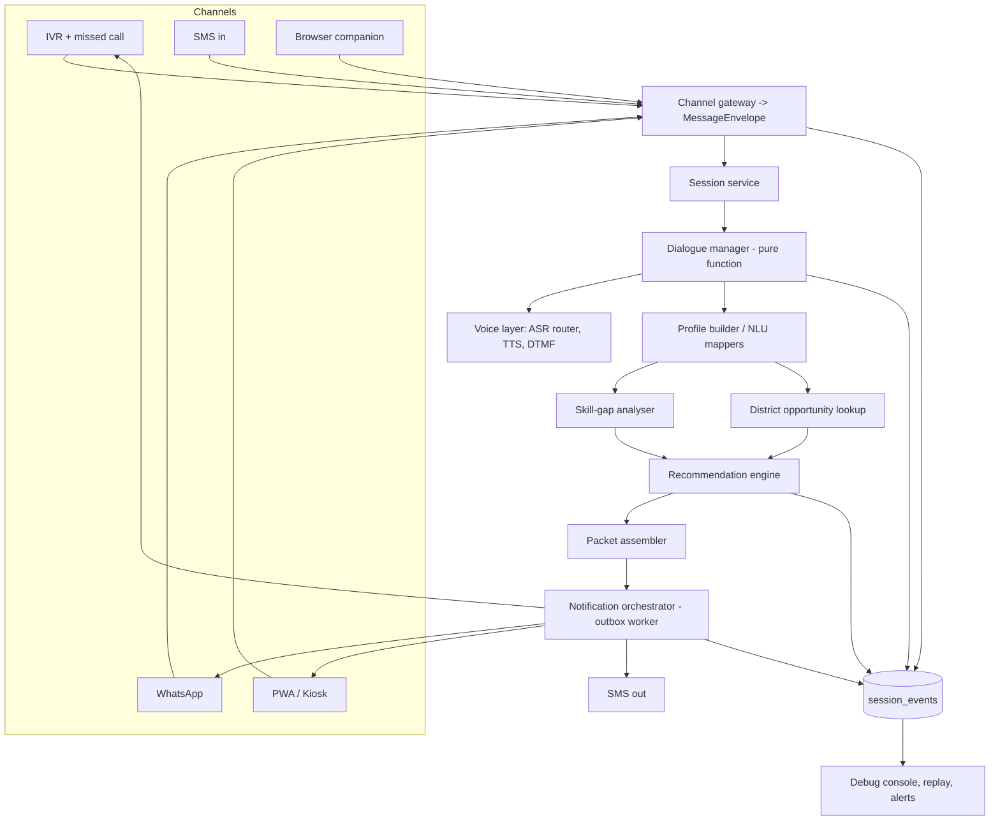

# SPEC.md - Detailed Implementation Specification

Companion to `AGENTS.md` (rules + invariants) and `tasks.yaml` (work items). Invariant IDs (INV-xx) refer to `AGENTS.md` section 4. Words **MUST / SHOULD / MAY** are used in the RFC sense.

## Contents
1. System overview and module map
2. Data model (DDL)
3. Contracts (Pydantic models)
4. Provider interfaces and fakes
5. Session service
6. Dialogue
7. IVR channel
8. Recommendation pipeline
9. Packet rendering
10. Notifications (SMS first)
11. WhatsApp
12. PWA, kiosk, browser companion
13. Observability and debuggability
14. Degrade ladder and channel router
15. API surface
16. Test plan
17. Pilot readiness gate
18. Admin dashboard and KPIs
19. Extensibility hooks (other states/languages)
20. Assumptions to record

---

## 1. System overview and module map

**Principle: one channel-agnostic engine, thin channel adapters.** Channels translate input/output only. Business logic lives once.



| Module (`src/pmajay/...`) | Responsibility | Spec section |
|---|---|---|
| `contracts` | Envelope, Profile, Packet, IvrAction models | 3 |
| `providers` | Adapter Protocols, fakes, real adapters | 4 |
| `session` | Session state, resume, checkpoint | 5 |
| `dialogue`, `nlu`, `language` | Slot filling, mappers, language selection | 6 |
| `channels/ivr` | Webhook -> dialogue -> actions | 7 |
| `skillgap`, `recommend`, `packet` | The four outputs | 8, 9 |
| `notify` | SMS/voice/WhatsApp notifications | 10 |
| `channels/whatsapp` | WhatsApp flow | 11 |
| `channels/pwa_api`, `web/*` | PWA, kiosk, companion | 12 |
| `observability`, `router` | Events, health, alerts, degrade | 13, 14 |
| `admin` | RBAC, dashboard, audit | 18 |

---

## 2. Data model (DDL)

Implement as Alembic migrations (INV-21). Types are Postgres. All timestamps `TIMESTAMPTZ`. Enable `postgis` and `pgcrypto` extensions.

### 2.1 Identity and profile (strict separation, INV-01)

```sql
CREATE TABLE beneficiary_identity (
  phone_hash       TEXT PRIMARY KEY,                -- HMAC-SHA256(pepper, e164), hex
  phone_encrypted  BYTEA NOT NULL,                  -- AES-256-GCM(e164); nonce prefixed
  created_at       TIMESTAMPTZ NOT NULL DEFAULT now()
);

CREATE TABLE beneficiary_profile (
  phone_hash           TEXT PRIMARY KEY REFERENCES beneficiary_identity(phone_hash) ON DELETE CASCADE,
  language             TEXT,                         -- 'mr' | 'hi' (ISO 639-1/-3)
  dialect_tag          TEXT,
  district_lgd         TEXT,
  education_grade      SMALLINT,                     -- class completed, 0..16
  education_band       SMALLINT,                     -- 1..5 (see 6.1)
  primary_interest     TEXT,
  nsqf_interest_code   TEXT,
  family_occupation    TEXT,
  rpl_eligible         BOOLEAN,
  mobility_constraint  BOOLEAN,
  preference           TEXT CHECK (preference IN ('self_employment','wage','either')),
  nearest_market       TEXT,
  slot_confidence      JSONB NOT NULL DEFAULT '{}',
  anomaly_flag         BOOLEAN NOT NULL DEFAULT false,
  updated_at           TIMESTAMPTZ NOT NULL DEFAULT now()
);
-- NOTE: no name, no community, no income, no gender columns.
```

### 2.2 Sessions, events, packets

```sql
CREATE TABLE sessions (
  session_id         UUID PRIMARY KEY,
  phone_hash         TEXT NOT NULL REFERENCES beneficiary_identity(phone_hash) ON DELETE CASCADE,
  first_channel      TEXT NOT NULL,                 -- ivr|sms|whatsapp|pwa|kiosk|extension
  call_number        SMALLINT NOT NULL DEFAULT 1,   -- 1 or 2
  state              TEXT NOT NULL,                 -- see 5.2
  last_confirmed_slot TEXT,
  resume_state       JSONB NOT NULL DEFAULT '{}',   -- dialogue state snapshot (no PII beyond slots)
  language           TEXT,
  consent_given      BOOLEAN NOT NULL DEFAULT false,
  consent_at         TIMESTAMPTZ,
  assisted_session   BOOLEAN NOT NULL DEFAULT false,
  operator_id        TEXT,
  validated_by       TEXT,                          -- supervisor, for assisted sessions (INV-16)
  started_at         TIMESTAMPTZ NOT NULL DEFAULT now(),
  last_activity_at   TIMESTAMPTZ NOT NULL DEFAULT now(),
  completed_at       TIMESTAMPTZ
);
CREATE INDEX ix_sessions_phone ON sessions(phone_hash);

CREATE TABLE session_events (            -- append-only
  event_id     UUID PRIMARY KEY,
  session_id   UUID,                      -- nullable only for system events
  ts           TIMESTAMPTZ NOT NULL DEFAULT now(),
  channel      TEXT,
  event_type   TEXT NOT NULL,             -- registry: config/event_types.yaml
  error_code   TEXT,                      -- registry: config/error_codes.yaml
  latency_ms   INTEGER,
  data         JSONB NOT NULL DEFAULT '{}'    -- scrubbed; never phone/community/income
);
CREATE INDEX ix_events_session_ts ON session_events(session_id, ts);
CREATE INDEX ix_events_type_ts ON session_events(event_type, ts);
-- Revoke UPDATE/DELETE on session_events from the app role (append-only), except the TTL job role.

CREATE TABLE packets (
  packet_id          UUID PRIMARY KEY,
  session_id         UUID NOT NULL REFERENCES sessions(session_id),
  phone_hash         TEXT NOT NULL,
  call_number        SMALLINT NOT NULL,
  payload            JSONB NOT NULL,      -- Packet (section 3)
  algorithm_version  TEXT NOT NULL,
  weights            JSONB NOT NULL,
  created_at         TIMESTAMPTZ NOT NULL DEFAULT now()
);
```

### 2.3 Reference data

```sql
CREATE TABLE lgd_districts (
  lgd_code    TEXT PRIMARY KEY,
  state_code  TEXT NOT NULL,
  name_en     TEXT NOT NULL,
  name_mr     TEXT, name_hi TEXT,
  aliases     TEXT[] NOT NULL DEFAULT '{}',   -- spellings/transliterations
  synthetic   BOOLEAN NOT NULL DEFAULT false
);

CREATE TABLE qualification_packs (
  qp_code                TEXT PRIMARY KEY,
  name_i18n              JSONB NOT NULL,       -- {"en":..,"mr":..,"hi":..}
  ssc                    TEXT NOT NULL,
  sector                 TEXT NOT NULL,
  nsqf_level             SMALLINT NOT NULL,
  duration_hours         INTEGER,
  min_education_grade    SMALLINT NOT NULL DEFAULT 0,
  physical_requirements  TEXT[] NOT NULL DEFAULT '{}',   -- e.g. 'heavy_lifting','sustained_standing'
  required_competencies  TEXT[] NOT NULL DEFAULT '{}',
  scheme_tags            TEXT[] NOT NULL DEFAULT '{}',   -- PMKVY, PM-AJAY-GIA, NSFDC, STANDUP, MUDRA
  interest_aliases       JSONB NOT NULL DEFAULT '{}',    -- {"mr":["शिवणकाम",..],"hi":[..],"en":[..]}
  source_version         TEXT,
  synthetic              BOOLEAN NOT NULL DEFAULT false
);
CREATE INDEX ix_qp_sector ON qualification_packs(sector);

CREATE TABLE training_centres (
  centre_id         UUID PRIMARY KEY,
  name              TEXT NOT NULL,
  district_lgd      TEXT NOT NULL REFERENCES lgd_districts(lgd_code),
  geom              GEOGRAPHY(Point,4326) NOT NULL,
  phone             TEXT,                          -- may be NULL => never recommended
  seats             INTEGER,
  status            TEXT NOT NULL DEFAULT 'active' CHECK (status IN ('active','unresponsive','closed')),
  last_verified_at  TIMESTAMPTZ,
  source            TEXT,
  synthetic         BOOLEAN NOT NULL DEFAULT false
);
CREATE INDEX ix_centres_geom ON training_centres USING GIST (geom);
CREATE INDEX ix_centres_district_verified ON training_centres(district_lgd, last_verified_at);

CREATE TABLE centre_courses (
  centre_id   UUID REFERENCES training_centres(centre_id) ON DELETE CASCADE,
  qp_code     TEXT REFERENCES qualification_packs(qp_code),
  next_batch  DATE,
  seats_open  INTEGER,
  PRIMARY KEY (centre_id, qp_code)
);

CREATE TABLE pathways (
  pathway_id    UUID PRIMARY KEY,
  sector        TEXT NOT NULL,
  type          TEXT NOT NULL CHECK (type IN ('wage','self_employment','rpl','apprenticeship')),
  label_i18n    JSONB NOT NULL,
  next_step_i18n JSONB NOT NULL,
  scheme_tag    TEXT,
  active        BOOLEAN NOT NULL DEFAULT true,
  synthetic     BOOLEAN NOT NULL DEFAULT false
);

CREATE TABLE district_profiles (
  lgd_code       TEXT PRIMARY KEY REFERENCES lgd_districts(lgd_code),
  top_sectors    TEXT[] NOT NULL DEFAULT '{}',
  sector_demand  JSONB NOT NULL DEFAULT '{}',     -- {"Apparel":0.31,...} normalised 0..1
  updated_at     TIMESTAMPTZ NOT NULL DEFAULT now()
);

CREATE TABLE district_opportunities (
  opportunity_id UUID PRIMARY KEY,
  lgd_code       TEXT NOT NULL REFERENCES lgd_districts(lgd_code),
  source         TEXT NOT NULL CHECK (source IN ('ncs','mudra','msme','nodal_pin')),
  sector         TEXT,
  qp_code        TEXT,
  label_i18n     JSONB NOT NULL,
  detail_i18n    JSONB,
  pinned         BOOLEAN NOT NULL DEFAULT false,
  valid_until    DATE,
  synthetic      BOOLEAN NOT NULL DEFAULT false
);

CREATE TABLE district_contacts (          -- who to call for an intervention
  contact_id   UUID PRIMARY KEY,
  lgd_code     TEXT NOT NULL,
  role         TEXT NOT NULL CHECK (role IN ('rseti','ssc_assessment','nodal_officer','csc_coordinator')),
  sector       TEXT,                       -- for ssc_assessment
  name         TEXT, phone TEXT NOT NULL,
  synthetic    BOOLEAN NOT NULL DEFAULT false
);

CREATE TABLE state_language_map (         -- language/state config as data (section 19)
  state_code TEXT, language_code TEXT, role TEXT, tier CHAR(1),
  voice_mode TEXT, standby_asr BOOLEAN, tts_available BOOLEAN, sms_script TEXT,
  last_verified_at TIMESTAMPTZ, PRIMARY KEY (state_code, language_code));
CREATE TABLE district_language_mix (
  lgd_code TEXT, language_code TEXT, census_share NUMERIC, source_year INT,
  PRIMARY KEY (lgd_code, language_code));
```

### 2.4 Notifications, call-backs, outcomes, ops

```sql
CREATE TABLE notifications (
  notification_id     UUID PRIMARY KEY,
  idempotency_key     TEXT NOT NULL UNIQUE,      -- session_id|type|sequence
  session_id          UUID,
  phone_hash          TEXT,                       -- NULL for staff/ops notifications
  recipient_kind      TEXT NOT NULL CHECK (recipient_kind IN ('beneficiary','staff','oncall')),
  recipient_ref       TEXT,                       -- staff user id; never a raw beneficiary number
  type                TEXT NOT NULL,              -- N1..N14 key e.g. 'N1_REC'
  template_id         TEXT NOT NULL,
  language            TEXT NOT NULL,
  variables           JSONB NOT NULL DEFAULT '{}',-- validated against template allow-list
  channel_plan        TEXT[] NOT NULL,            -- e.g. {'sms','voice','human'}
  state               TEXT NOT NULL,              -- see 10.2
  attempt             SMALLINT NOT NULL DEFAULT 0,
  next_attempt_at     TIMESTAMPTZ,
  provider            TEXT,
  provider_message_id TEXT,
  last_error_code     TEXT,
  created_at          TIMESTAMPTZ NOT NULL DEFAULT now(),
  updated_at          TIMESTAMPTZ NOT NULL DEFAULT now()
);
CREATE INDEX ix_notif_due ON notifications(next_attempt_at) WHERE state IN ('queued','retry_wait');
CREATE UNIQUE INDEX ux_notif_provider_msg ON notifications(provider, provider_message_id) WHERE provider_message_id IS NOT NULL;

CREATE TABLE human_callbacks (
  callback_id  UUID PRIMARY KEY,
  session_id   UUID, phone_hash TEXT,
  reason       TEXT NOT NULL,       -- user_request|sms_undeliverable|anomaly_review|rpl_referral|no_asr_language|other
  language     TEXT, due_by TIMESTAMPTZ NOT NULL,
  state        TEXT NOT NULL DEFAULT 'open' CHECK (state IN ('open','assigned','done','escalated')),
  assigned_to  TEXT, created_at TIMESTAMPTZ NOT NULL DEFAULT now(), done_at TIMESTAMPTZ
);

CREATE TABLE outcomes (
  phone_hash            TEXT NOT NULL,
  packet_id             UUID NOT NULL REFERENCES packets(packet_id),
  centre_contacted_7d   BOOLEAN,            -- NULL until known (primary quality metric)
  enrolled_30d          TEXT CHECK (enrolled_30d IN ('yes','no','deciding')),
  follow_up_30d_at      TIMESTAMPTZ,
  counterfactual_group  BOOLEAN NOT NULL DEFAULT false,
  created_at            TIMESTAMPTZ NOT NULL DEFAULT now(),
  PRIMARY KEY (phone_hash, packet_id)
);
CREATE INDEX ix_outcomes_pending ON outcomes(created_at) WHERE enrolled_30d IS NULL;

CREATE TABLE audit_log (
  id BIGSERIAL PRIMARY KEY, ts TIMESTAMPTZ NOT NULL DEFAULT now(),
  actor_id TEXT NOT NULL, phone_hash TEXT, session_id UUID,
  action TEXT NOT NULL, reason TEXT, approver_id TEXT);
CREATE INDEX ix_audit_phone_ts ON audit_log(phone_hash, ts);

CREATE TABLE record_access_requests (
  request_id UUID PRIMARY KEY, actor_id TEXT NOT NULL, session_id UUID, phone_hash TEXT,
  reason TEXT NOT NULL, approver_id TEXT, approved_at TIMESTAMPTZ, expires_at TIMESTAMPTZ,
  CHECK (approver_id IS NULL OR approver_id <> actor_id));

CREATE TABLE operators (
  operator_id TEXT PRIMARY KEY, csc_location_id TEXT NOT NULL,
  quiz_score SMALLINT, certified_at TIMESTAMPTZ, active BOOLEAN NOT NULL DEFAULT true);
CREATE TABLE kiosk_devices (
  device_id TEXT PRIMARY KEY, csc_location_id TEXT NOT NULL,
  activated_at TIMESTAMPTZ, last_heartbeat_at TIMESTAMPTZ);

CREATE TABLE channel_health (
  component TEXT PRIMARY KEY,   -- ivr|sms_primary|sms_secondary|whatsapp|asr_t1|asr_t2|tts|postgres|redis|pwa
  status TEXT NOT NULL,         -- ok|degraded|down|unknown
  last_success_at TIMESTAMPTZ, last_failure_at TIMESTAMPTZ, detail JSONB);

CREATE TABLE feature_flags (key TEXT PRIMARY KEY, value JSONB NOT NULL, updated_by TEXT, updated_at TIMESTAMPTZ NOT NULL DEFAULT now());
CREATE TABLE oncall_roster (user_id TEXT PRIMARY KEY, name TEXT, phone_encrypted BYTEA NOT NULL, level SMALLINT NOT NULL, active BOOLEAN NOT NULL DEFAULT true);
```

### 2.5 Retention jobs (implement in `jobs/`)
- Delete raw audio at `AUDIO_TTL_S` or on transcription confirm (INV-04).
- Null `data.transcript_redacted` in `session_events` older than `EVENT_TRANSCRIPT_TTL_DAYS`.
- Erasure: `POST /v1/erasure` deletes `beneficiary_identity` row (cascades), and scrubs `session_events.data` for that beneficiary's sessions.

---

## 3. Contracts (Pydantic v2; export JSON Schema to `contracts/schemas/`)

```python
class Channel(StrEnum): ivr="ivr"; sms="sms"; whatsapp="whatsapp"; pwa="pwa"; kiosk="kiosk"; extension="extension"

class MessageEnvelope(BaseModel):
    event_id: UUID; session_id: UUID | None; phone_hash: str
    channel: Channel; direction: Literal["in","out"]
    kind: Literal["audio","dtmf","text","system"]
    payload_ref: str | None      # opaque pointer (audio blob id, text id); never the raw number
    language_hint: str | None
    assisted_session: bool = False; operator_id: str | None = None
    ts: datetime; seq: int

class SlotValue(BaseModel):
    value: str | int | bool | None
    confidence: float            # 0..1
    confirmed: bool = False
    via: Literal["speech","dtmf","operator","default"]

class ProfileV2(BaseModel):                      # in-memory working profile
    session_id: UUID; phone_hash: str; call_number: Literal[1,2]
    language_detected: str | None; language_confirmed_by_user: bool = False
    dialect_tag: str | None = None
    district_lgd: SlotValue | None; education_band: SlotValue | None
    primary_interest: SlotValue | None; nsqf_interest_code: str | None
    family_occupation: SlotValue | None; mobility_constraint: SlotValue | None
    preference: SlotValue | None; nearest_market: SlotValue | None
    rpl_eligible: bool | None = None
    assisted_session: bool = False; operator_id: str | None = None
    consent_given: bool = False; consent_timestamp: datetime | None = None
    anomaly_flag: bool = False

class Centre(BaseModel):
    centre_id: UUID; name: str; distance_km: float
    phone: str; last_verified_at: datetime; status: Literal["active"]

class ProgramRec(BaseModel):
    rank: int; qp_code: str; name: str; nsqf_level: int; ssc_sector: str
    duration_hours: int | None; scheme_tags: list[str]
    centre: Centre; why_one_line: str
    is_aspiration_override: bool = False; override_note: str | None = None

class PathwayRec(BaseModel):
    type: Literal["wage","self_employment","rpl","apprenticeship"]
    label: str; next_step: str

class Intervention(BaseModel):
    type: Literal["none","bridge_module","foundation_literacy","rpl_assessment"]
    owner: Literal["training_centre","rseti","ssc_coordinator","none"]
    contact_phone: str | None

class SkillGap(BaseModel):
    severity: Literal["zero","partial","major"]
    gaps: list[str]; intervention: Intervention

class LocalOpportunity(BaseModel):
    label: str; source: Literal["ncs","mudra","msme","nodal_pin"]; detail: str | None

class NextAction(BaseModel):
    text: str; within_days: int = 7

class RecommendationPacket(BaseModel):
    packet_id: UUID; session_id: UUID; language: str; call_number: Literal[1,2]
    partial: bool                                  # True after Call 1 (max 2 programs)
    programs: list[ProgramRec]                     # >=1 unless 'no_match' reason set
    pathways: list[PathwayRec]
    skill_gap: SkillGap
    local_opportunities: list[LocalOpportunity]
    next_action: NextAction
    empty_section_reasons: dict[str,str] = {}      # section -> reason, if a section is empty
    algorithm_version: str
```

**Packet validity rule (tested):** every packet has all four output sections populated, OR an explicit reason in `empty_section_reasons` for each empty section. Packets MUST NOT contain: name, phone number of the beneficiary, community, income, or any word implying eligibility ("eligible", "approved", "entitled", "sanctioned") (INV-07).

### 3.1 IVR action/event models (`contracts/ivr.py`)

```python
IvrEvent = CallStarted(call_id, from_e164, to_number, direction) | Dtmf(call_id, digits) \
         | RecordingReady(call_id, audio_ref, duration_s) | Silence(call_id) | CallEnded(call_id, reason)

IvrAction = Play(prompt_id, vars) | Gather(prompt_id, vars, max_digits, timeout_s, retries) \
          | Record(prompt_id, vars, max_seconds, silence_timeout_s) | Hangup() \
          | ScheduleCallback(at, reason)
```

---

## 4. Provider interfaces and fakes

All external services go through these Protocols (INV-24). Real adapters live in `providers/real/`. If vendor API documentation is not accessible to you, implement the adapter against the Protocol with `NotImplementedError("needs vendor docs")`, add contract-test fixtures TODOs, and mark the task `blocked_by_human`.

```python
class AsrResult(BaseModel):
    text: str; confidence: float; language: str | None; tier: int; latency_ms: int

class AsrProvider(Protocol):
    name: str; tier: int
    async def transcribe(self, audio: bytes, mime: str, lang_hints: list[str]) -> AsrResult: ...   # raises AsrError(code)

class TtsProvider(Protocol):
    async def synthesize(self, text: str, lang: str, rate: float = 1.0) -> bytes: ...             # raises TtsError

class TelephonyProvider(Protocol):
    async def place_call(self, to_e164: str, flow_ref: str, at: datetime | None) -> str: ...      # call id
    def parse_webhook(self, headers: dict, body: bytes) -> IvrEvent: ...                           # verifies signature
    def render_actions(self, actions: list[IvrAction]) -> tuple[bytes, str]: ...                   # payload, content-type

class SmsSendResult(BaseModel):
    provider_message_id: str; accepted: bool; error_code: str | None; retryable: bool

class SmsProvider(Protocol):
    name: str
    async def send(self, to_e164: str, body: str, sender_id: str, dlt_template_id: str | None, unicode: bool) -> SmsSendResult: ...
    def parse_receipt(self, headers: dict, body: bytes) -> "SmsReceipt": ...                       # provider_message_id, state: delivered|failed|unknown
    def parse_inbound(self, headers: dict, body: bytes) -> "InboundSms": ...                       # from_e164, text

class WhatsAppProvider(Protocol):
    async def send_text(self, to_e164: str, text: str) -> str: ...
    async def send_voice_note(self, to_e164: str, audio: bytes) -> str: ...
    async def send_template(self, to_e164: str, template_id: str, vars: dict, lang: str) -> str: ...
    def parse_webhook(self, headers: dict, body: bytes) -> list["WaInboundEvent"]: ...             # message id, type text|audio|status
    async def download_media(self, media_ref: str) -> tuple[bytes, str]: ...

class Clock(Protocol):
    def now(self) -> datetime: ...                        # injectable for tests (retry ladder, calling hours, 48h resume)
```

### 4.1 Fakes (`providers/fakes/`) - REQUIRED, used by every test

Each fake accepts a **fault script**: a list/callable of behaviours applied per call.

| Mode | Behaviour |
|---|---|
| `ok` | succeed |
| `error` | raise provider error (`retryable` configurable) |
| `timeout` | exceed latency threshold |
| `slow(ms)` | add latency |
| `reject_template` | SMS: `accepted=False, error=E-SMS-001, retryable=False` |
| `no_receipt` | SMS accepted, never send a receipt |
| `receipt_failed` | SMS accepted, receipt state `failed` |
| `duplicate_delivery` | webhook delivered twice |
| `scripted_asr` | ASR returns pre-scripted `(text, confidence)` sequence |

The fake telephony provider exposes a **simulator** (`FakeCaller`) that drives a call: `say_dtmf("1")`, `speak(text, confidence)`, `hangup()`, and records every action the system returned. Scenario tests use it for IVR journeys.

### 4.2 ASR router (`providers/asr_router.py`)

```
tiers = [tier1, tier2]; circuit state per tier: closed | open(until)
on transcribe(audio):
  for tier in tiers where circuit closed (or half-open probe):
      try: r = await tier.transcribe(...) with timeout ASR_LATENCY_MS
           if r ok: reset consecutive_errors(tier); return r
      except/timeout: consecutive_errors(tier) += 1; emit asr.failover if switching
           if consecutive_errors(tier) >= ASR_FAILOVER_ERRORS: open circuit for 60 s (assumption A-12)
  if no tier available: raise AsrUnavailable -> caller switches session to DTMF-only (emit asr.dtmf_fallback)
```
A tier that is `open` is probed once after cool-down (half-open); success closes it.

---

## 5. Session service

### 5.1 Responsibilities
- Resolve any inbound identity (phone number from any channel) -> `phone_hash` (INV-01) -> session.
- Hold **hot state in Redis** (key `sess:{session_id}`, TTL = `SESSION_RESUME_HOURS`), checkpoint to Postgres `sessions.resume_state` every `CHECKPOINT_INTERVAL_S` **and** after every confirmed slot (INV-20).
- Resume: if the same `phone_hash` has an incomplete session with `last_activity_at` within `SESSION_RESUME_HOURS`, return it (any channel) (INV-06).
- Concurrency: writes to a session use optimistic versioning (`resume_state.version`); a conflicting write emits `E-SES-002` and retries once with merge (last-confirmed-slot wins per slot).

### 5.2 Session state machine

```
CREATED -> GREETED -> LANGUAGE_SET -> CONSENTED -> CALL1_SLOTS -> CALL1_DONE -> (CALL2_SCHEDULED) -> CALL2_SLOTS -> COMPLETE
                                  \-> CONSENT_DECLINED -> ENDED
any state -> DROPPED (call dropped / timeout)  -> resumable
any state -> HUMAN_HANDOFF (user pressed 0 / anomaly / unsupported)
```
Each transition emits `session.state_changed` with `from`, `to`.

---

## 6. Dialogue

### 6.1 Dialogue manager is a **pure function**

```python
def step(state: DialogueState, user_input: UserInput, cfg: DialogueConfig) -> tuple[DialogueState, list[Output]]
```
No I/O inside. Inputs: `Speech(text, confidence, lang)` | `Dtmf(digits)` | `Silence` | `Resume` | `Hangup`. Outputs: `Say(prompt_id, vars)`, `AskDtmf(prompt_id, vars, allowed_digits)`, `AskSpeech(prompt_id, vars)`, `SlotFilled(slot, value)`, `NeedHuman(reason)`, `Done(call_number)`. Because it is pure, any session can be **replayed** from its events (section 13.8).

### 6.2 Slots

| Slot | Call | Mode | Validation | Gate | DTMF fallback |
|---|---|---|---|---|---|
| `district` | 1 | open speech | match `lgd_districts` names/aliases (mr/hi/en), edit distance <= 2 | critical (INV-08) | menu of up to 4 nearest candidates, else the first 4 of `PILOT_DISTRICTS`; `9` = other -> human call-back |
| `education` | 1 | speech + DTMF confirm | map to band 1-5 | confidence >= 0.75 else DTMF | `1..5` per table below |
| `interest` | 1 | open speech | match QP `interest_aliases` -> `nsqf_interest_code`; no match -> keep raw text, ask one follow-up | critical (INV-08) | menu from `content/nlu/interest_menu.yaml` (top 4 pilot sectors), `9` = other -> human |
| `language` | 1 | auto + confirm | candidate set (6.3) | threshold `LANG_CONF_THRESHOLD` | `1`=Marathi `2`=Hindi |
| `mobility` | 2 | DTMF | `1`=yes, `2`=no | - | - |
| `preference` | 2 | DTMF | `1`=self-employment `2`=wage `3`=either | - | - |
| `family_occupation` | 2 | open speech | match RPL occupation aliases | non-critical | menu from `content/nlu/occupation_menu.yaml`; may skip |
| `nearest_market` | 2 | open speech | match place aliases / LGD | non-critical | may skip |

**Education bands (DTMF and storage):**

| Band | Meaning | Stored `education_grade` |
|---|---|---|
| 1 | Never attended / up to class 4 | 2 |
| 2 | Class 5-7 | 6 |
| 3 | Class 8-9 | 8 |
| 4 | Class 10-11 | 10 |
| 5 | Class 12 or above (incl. diploma/graduate) | 12 |

Spoken phrases map to a precise grade when stated (e.g. "eighth pass" -> 8), then to the band; store both. Maintain `content/nlu/education_terms.yaml` (mr/hi/en); entries start `draft_unreviewed`.

**Gating logic (INV-08), per critical slot:**
```
attempt 1: AskSpeech.  If conf >= 0.75 and valid -> AskDtmf confirm ("You said X. Press 1 if correct, 2 to try again").
           If conf < 0.75 or invalid -> attempt 2.
attempt 2: AskSpeech with a narrower prompt.  Same check.
attempt 3: switch to DTMF menu for that slot.  If user fails again -> NeedHuman(reason).
Never ask the same prompt more than twice.  Silence: re-prompt once, then DTMF.
```

### 6.3 Language selection (INV-22)
1. Candidate set = top 2 languages from `district_language_mix` for the district (or `PILOT_DISTRICTS` default `mr`,`hi`) plus `hi` and `en` fallback.
2. Open with a **bilingual greeting** (prompt `greet.bilingual`), not a menu.
3. Detect from the **first 3 utterances combined** using ASR-reported language + a script/keyword baseline (`language/detector.py`), restricted to the candidate set.
4. If confidence >= `LANG_CONF_THRESHOLD` -> set; later utterances may switch the language only if confidence exceeds the threshold again.
5. If after 3 utterances confidence is still below threshold -> short spoken menu (`1`=Marathi `2`=Hindi).
6. If detected language is not in the district's candidate set -> ask to confirm ("Shall we continue in X?"). Never infer language from anything about caste.

### 6.4 Consent, flow, resume

**Consent (two moments).** After the language is set:
- Moment 1 (mandatory): read prompt `consent.m1` then "Press 1 to agree, 2 to hear more." No slot is asked until `1` is pressed. `2` plays `consent.m2` (full notice), then asks again. Declined/no answer -> `CONSENT_DECLINED`, polite end, SMS N1 not sent, no profile stored beyond session metadata.
- The text of `consent.m1`/`consent.m2` is a **legal draft** (`review_status: draft_unreviewed`). Do not mark it reviewed. Include a draft sentence that a text message will be sent.

**Call 1 (mandatory, target ~4 min):** `district -> education -> interest -> language(confirm)`; then produce a **partial packet** (max 2 programs) and speak it. Offer Call 2: "Press 1 for us to call you back tomorrow morning" -> `ScheduleCallback` for next day 09:00 local (config) inside calling hours. Always trigger **N1** SMS.

**Call 2 (optional, ~4 min):** `mobility -> preference -> family_occupation -> nearest_market`; then the **full packet** (top 3 + aspiration override).

**Resume (INV-06):** if a resumable session exists, open with: "Last time you told me you live in {district} and studied up to {education}. Is that still correct? Press 1 for yes, 2 if something has changed." `1` -> continue from the next unfilled slot. `2` -> re-ask the changed slots (ask which: `1` district, `2` education).

**Human exit:** at any prompt `0` -> `NeedHuman("user_request")` -> create `human_callbacks` row (due within 4 working hours, assumption A-13) + SMS N14 to counsellor + confirmation SMS/voice to user.

### 6.5 Anomaly detection (profile builder)
If a returning beneficiary's `education_band` differs by more than 1 band, or the interest's QP NSQF level differs by more than 1 level, from the stored profile: set `anomaly_flag=true`, **do not generate a packet**, create `human_callbacks(reason='anomaly_review')`, tell the user a counsellor will call, send N7-style SMS. (Advisory-only system; human review decides.)

### 6.6 Content catalogue (`content/prompts/*.yaml`)

All spoken/shown text lives here. Never hard-code user-facing strings.

```yaml
- id: consent.m1
  purpose: "Mandatory one-sentence consent"
  vars: []
  max_seconds: 12
  text:
    en: {text: "Your answers help us find the right training for you. We do not share them outside the government. A text message will be sent to you.", review_status: draft_unreviewed}
    mr: {text: "<draft translation>", review_status: draft_unreviewed}
    hi: {text: "<draft translation>", review_status: draft_unreviewed}
  audio: {mr: null, hi: null}      # pre-rendered file ids, filled by the audio pipeline
```
Rules: English is the source. You MAY machine-draft `mr`/`hi` for development, always `draft_unreviewed`. Humans promote to `reviewed`. A loader MUST refuse `draft_unreviewed` text when `ENV=prod` (INV-18). Include the 50 most frequent phrases flagged `pre_render: true`. Voice persona notes (warm, mid-pace, affirmations like "ठीक आहे"/"अच्छा") are in the prompt metadata `tone`.

Minimum prompt IDs: `greet.bilingual`, `lang.confirm`, `lang.menu`, `consent.m1`, `consent.m2`, `consent.ask`, `slot.district.ask`, `slot.district.ask2`, `slot.district.menu`, `slot.education.ask`, `slot.education.menu`, `slot.interest.ask`, `slot.interest.menu`, `slot.mobility.ask`, `slot.preference.ask`, `slot.family_occupation.ask`, `slot.nearest_market.ask`, `confirm.echo`, `resume.readback`, `silence.reprompt`, `dtmf.fallback_notice`, `call1.partial_intro`, `call1.offer_call2`, `call2.intro`, `packet.program`, `packet.pathway`, `packet.skillgap`, `packet.opportunity`, `packet.next_action`, `human.callback_confirm`, `drop.sorry`, `goodbye`, `error.generic`.

---

## 7. IVR channel

**Entry points (all go to the same flow):** (1) inbound call to `TOLLFREE_NUMBER`; (2) **missed call** to `MISSED_CALL_NUMBER` -> system places an outbound call-back within a target (default 60 s, assumption A-14), inside calling hours, else queued to next window with SMS `N4`; (3) SMS keyword -> call-back (section 10.6); (4) scheduled Call 2 / follow-up calls.

**Webhook handler:** `POST /webhooks/ivr/{provider}` ->
```
event = provider.parse_webhook(...)            # signature verified; invalid => 401 + E-CH-001
session = session_service.resolve(event)
(state', outputs) = dialogue.step(session.dialogue_state, to_user_input(event), cfg)
actions = translate(outputs)                   # Say/AskDtmf/AskSpeech -> Play/Gather/Record
persist state' + emit events
return provider.render_actions(actions)
```
- On `RecordingReady`: fetch audio -> `asr_router.transcribe` -> `Speech(...)` into `step`. Audio deleted right after confirmation (INV-04).
- Audio is narrowband telephony; ASR adapters MUST accept 8 kHz input.
- If `asr_router` raises `AsrUnavailable`: set `session.voice_mode=dtmf_only`; continue with DTMF prompts.
- **Call drop** (`CallEnded` with reason != normal, before `COMPLETE`): state -> `DROPPED`, emit `channel.in`, enqueue **N2** SMS within 2 minutes, enqueue a call-back offer.
- Prompts: pre-rendered audio when `audio[lang]` exists, otherwise TTS at runtime.
- Latency budget: webhook response p95 < 1 s excluding ASR; end-to-end audio-in to audio-out < 4 s on a simulated 128 kbps link (tested in `tests/load`).

---

## 8. Recommendation pipeline

### 8.1 Inputs / outputs
Input: confirmed `ProfileV2` (min viable = Call 1 slots). Output: `RecommendationPacket` (partial after Call 1, full after Call 2). Algorithm version string `rec-1.0.0`; weights stored on each packet.

### 8.2 Skill-gap analyser (`skillgap/`)

For a candidate QP and a profile:
```
edu_delta = max(0, qp.min_education_grade - profile.education_grade)
comp_missing = qp.required_competencies - competencies_from(profile)   # via content/nlu/occupation_competency.yaml
severity:
  major   if edu_delta >= 3 or ('literacy' in comp_missing)
  partial if edu_delta in {1,2} or len(comp_missing) > 0
  zero    otherwise
intervention:
  zero    -> none
  partial -> bridge_module, owner=training_centre, phone=centre.phone
  major   -> foundation_literacy, owner=rseti, phone=district_contacts(role=rseti)
rpl: if family_occupation or interest maps to the QP's sector AND profile.rpl_eligible -> intervention=rpl_assessment,
     owner=ssc_coordinator, phone=district_contacts(role=ssc_assessment, sector) ; create RPL referral (N7)
```
`competencies_from` uses the alias tables; when unknown, treat as no competencies (conservative). Traditional/informal skills (pottery, weaving, leatherwork, construction) map to the nearest QP via `content/nlu/occupation_to_qp.yaml` (RPL pathway). Hazardous occupations MUST NOT be a default pathway; keep a `hazardous: true` flag in that table and exclude them from `pathways` unless the beneficiary asked for them explicitly.

### 8.3 Candidate generation and filters
1. All QPs offered by an `active`, fresh (`last_verified_at >= now - CENTRE_STALE_DAYS`), phone-bearing centre in the beneficiary's district; if none, expand to the nearest centres by distance within a configurable radius (default 60 km, A-15). (INV-13)
2. **Hard exclude** QPs whose `physical_requirements` conflict with `mobility_constraint=true` (INV-15). Mapping `mobility_constraint -> blocked requirement tags` is data in `content/nlu/physical_blockers.yaml`.
3. Each candidate gets its skill-gap (8.2).

### 8.4 Scoring

Five axes, each in [0,1]; composite = weighted sum.

| Axis | Default weight | Baseline computation |
|---|---|---|
| aspiration_fit | 0.30 | 1.0 if `qp_code`/alias matches `nsqf_interest_code`; 0.6 if same sector as the interest; else 0.0. (If `FEATURE_EMBEDDING_MATCHER`: blend 50/50 with cosine similarity of IndicBERT-sentence embeddings between interest text and QP learning outcomes.) |
| capability_readiness | 0.25 | `zero`=1.0, `partial`=0.6, `major`=0.2 |
| local_demand | 0.20 | `district_profiles.sector_demand[sector]` (0..1); +0.2 capped at 1.0 if a `nodal_pin` opportunity references the QP/sector |
| access_feasibility | 0.15 | 1.0 if distance <= 10 km; linear to 0.0 at 60 km; 0 if centre excluded |
| scheme_eligibility | 0.10 | 1.0 if `scheme_tags` includes `PM-AJAY-GIA` or `PMKVY`; 0.7 if other scheme tag; 0.4 if none (advisory signal only, not an eligibility decision) |

Weights are configurable by the district nodal officer within **+/-0.10 absolute per weight**, then renormalised to sum to 1 (assumption A-16). Store effective weights on the packet. Gender and caste are **not model inputs** (they are not collected).

### 8.5 Selection
```
ranked = sort(candidates, key=composite desc, tiebreak: shorter distance, then qp_code)
top = ranked[:3]
# diversity (INV-14): if len({c.sector for c in top}) < 2 and a candidate from another sector exists:
#     replace the lowest-ranked of top with the best-scoring candidate from a different sector
aspiration = best candidate with aspiration_fit >= 0.6 that is NOT in top and is not hard-excluded
if aspiration: append as 4th with is_aspiration_override=true and override_note
              ("This course matches what you said you'd like to do, but you may need some preparation first. Here is what you would need.")
partial packet (Call 1): programs = top[:2] (no override)
dropout flag: if a QP has historical dropout rate for similar profiles above config threshold (data provided later), add a warning line and suggest bridge module / peer support. (No data in pilot: field exists, defaults off.)
```
`why_one_line` is generated from a template per language (no LLM required): interest match + distance, from the prompt catalogue.

### 8.6 Pathways and local opportunities
- `pathways`: from `pathways` table filtered by the top programme's sector and beneficiary `preference` (self_employment -> self_employment first; wage -> wage first; either -> both), plus an `rpl` pathway if 8.2 triggered it. Max 3.
- `local_opportunities`: from `district_opportunities` for the district: nodal-officer **pins first** (label "Recommended by your district office"), then sector-matching `ncs`, then `mudra`/`msme`. Max 2 (voice) / 4 (card).
- `next_action`: "Call {centre} within 7 days" (centre phone attached).

### 8.7 Bias audit tool (`recommend/bias_audit.py`, CLI)
Runs all synthetic personas (16.3), computes the recommended-sector distribution per subgroup (persona metadata `gender`, `language`, `district`; metadata is **test-only**, never a model input), and compares to a reference distribution loaded from `data/reference/national_nsqf_enrolment_by_sector.csv` (humans supply; tests use a synthetic reference). A subgroup **fails** if `H(subgroup)/H(reference) < 0.80` (Shannon entropy ratio, assumption A-17). Output: markdown report + non-zero exit on failure. Note in the report that 25 personas is a smoke test, not statistical proof.

---

## 9. Packet rendering (`packet/renderers/`)

One packet, five renderers. All derive from the same packet object so channels never disagree.

| Renderer | Output | Rules |
|---|---|---|
| `voice` | ordered list of `Say` items | programme 1, programme 2, pathway, skill-gap action, one opportunity, next action; "press 1 to hear the third option"; target <= 90 s of speech (A-18) |
| `sms` | one text (template `SMS_REC_01`) | programme 1 name, centre, km, centre phone, helpline; <= 2 Unicode segments (10.4) |
| `whatsapp` | text card + short voice note | voice note <= 60 s |
| `pwa` | JSON for the card UI (icons, tap-to-call, QR) | no required reading |
| `operator` | full packet + provenance (weights, scores) | auth-gated (INV-05) |

**Consistency test:** for any packet, the programme #1 name, centre phone, and distance in `sms`, `voice` and `whatsapp` renderings MUST be identical (tested).

---

## 10. Notifications (SMS first)

### 10.1 Orchestrator
A **transactional outbox**: business code calls `notify.enqueue(NotificationRequest)` which inserts a `notifications` row (in the same DB transaction as the triggering change). The `jobs/outbox_worker` polls due rows (`SELECT ... WHERE state IN ('queued','retry_wait') AND next_attempt_at <= now() FOR UPDATE SKIP LOCKED`), sends, and advances state. Every transition emits `notify.*` events.

`NotificationRequest(session_id, phone_hash|staff_ref, type, template_id, language, variables, channel_plan, idempotency_key)`. Duplicate `idempotency_key` -> no-op (INV-11).

### 10.2 State machine

```
queued -> sending -> sent -> delivered                       (receipt: delivered)
                       \-> unconfirmed                       (no receipt within SMS_RECEIPT_WAIT_MIN)
          sending -> retry_wait -> sending ...               (retryable failure or receipt failed)
          sending/retry_wait -> failed_sms                   (non-retryable, or ladder exhausted)
failed_sms -> voice_fallback_queued -> voice_sent | voice_failed
voice_failed -> human_handoff   (creates human_callbacks row)
```
`delivered` ONLY on a provider receipt (INV-12). `unconfirmed` is displayed on the dashboard and counted in metrics; it does not trigger a resend (avoids duplicates).

### 10.3 Retry, failover, fallback
- Attempt delays from `SMS_RETRY_LADDER_S` (default `0,120,900,7200` s). `attempt` increments each send.
- **Provider-level error** (5xx/timeout, `retryable=True`): immediately retry the same attempt via the **secondary** SMS provider; if that also fails, schedule the next ladder step.
- **Template rejection** (`reject_template`, `retryable=False`, `E-SMS-001`): no retry, no secondary; raise an alert (13.6); go to voice fallback.
- **Receipt = failed**: treat as retryable up to the ladder.
- **Ladder exhausted** -> `failed_sms` -> **voice fallback**: place a call that reads the same summary via TTS (only inside calling hours; otherwise schedule to next window) -> if the call is unanswered after 2 attempts -> `human_handoff`.
- Staff/ops notifications use the same machinery with `recipient_kind in ('staff','oncall')`.
- Before sending, the orchestrator MUST: check `CHANNEL_SMS` flag; validate the template `variables` allow-list; check segment count; in `prod` check INV-18.

### 10.4 Templates (`content/sms/*.yaml`)

```yaml
- id: SMS_REC_01
  purpose: "Call 1 / full recommendation summary"
  recipient: beneficiary
  variables: [course, centre, km, phone, helpline]   # allow-list; anything else is rejected
  max_segments: 2
  text:
    en: {text: "Course: {course}. Centre: {centre}, {km} km away. Call {phone} within 7 days. Help: {helpline}", review_status: reviewed_for_dev}
    mr: {text: "<draft>", review_status: draft_unreviewed, dlt_template_id: null}
    hi: {text: "<draft>", review_status: draft_unreviewed, dlt_template_id: null}
```
- **Forbidden variables:** name, community, income, Aadhaar, beneficiary phone. Enforced by a test over all templates.
- **Segment calculator** (`notify/segments.py`): if all characters are in the GSM-7 basic/extension set -> 160 chars single / 153 per part when concatenated (extension chars count 2); else UCS-2 -> 70 single / 67 per part. Emit `E-SMS-005` and refuse to send if segments > `max_segments`. Unit-test with Devanagari and English samples.
- Templates sent in `prod` MUST carry `dlt_template_id` and `review_status: reviewed` (INV-18). Send `unicode=true` for Indic text.
- Language of an SMS = the session's confirmed language, never a telecom-circle guess.
- If a handset cannot render the script, the voice fallback applies (10.3); do not retry in another script automatically.

### 10.5 Notification catalogue (all MUST be implemented; INV-10)

| ID | Trigger event | Recipient | Template(s) | Channel plan | Notes |
|---|---|---|---|---|---|
| N1 | Call 1 completed (consented) | beneficiary | `SMS_REC_01` (+ `WA_REC_01` if WhatsApp session) | sms, voice, human | refreshed after Call 2 |
| N2 | Call dropped before complete | beneficiary | `SMS_DROP_01` {number} | sms, voice, human | within 2 min |
| N3a | Call 2 scheduled | beneficiary | `SMS_CALL2_01` {when, number} | sms, voice, human | |
| N3b | 1 hour before scheduled Call 2 | beneficiary | `SMS_CALL2_REM_01` {when} | sms | |
| N4 | Missed call received but call-back not answered / out of hours | beneficiary | `SMS_MISSED_01` {number} | sms | |
| N5 | Recommended centre becomes unresponsive/unverified | beneficiary | `SMS_CENTRE_ALT_01` {centre, centre2, km, phone} | sms, voice, human | counsellor task if no alternative |
| N6 | 3 days after packet | beneficiary | `SMS_NUDGE_D3_01` {centre, helpline} + `WA_NUDGE_D3` | sms | reply `1`/`2` stored as `centre_contacted_7d` |
| N7 | RPL referral or anomaly review created | beneficiary + staff | `SMS_RPL_01` {rseti}; staff: `SMS_STAFF_RPL_01` {ref} | sms; staff: sms+task | `ref` = short packet id, not a phone number |
| N8 | WhatsApp unavailable for a new user | beneficiary | `SMS_FAILOVER_01` {number} | sms | |
| N9 | Day-30 follow-up | beneficiary | IVR call; `SMS_FUP_01` {number} if unanswered | voice then sms | up to 3 attempts on different days |
| N10 | Kiosk offline / sync backlog beyond threshold | staff (operator, coordinator) | `SMS_STAFF_KIOSK_01` {location, issue} | sms | |
| N11 | Operator certification expiring / new operator at location | staff | `SMS_STAFF_CERT_01` {location} | sms | assisted mode locked until certified |
| N12 | System alert (canary fail, gateway down, error spike) | on-call | `SMS_ALERT_01` {code, summary, ack_code} | **sms + voice** | escalation, 13.6 |
| N13 | Erasure completed | beneficiary | `SMS_ERASE_01` | sms | |
| N14 | Human call-back requested | staff (counsellor) + beneficiary confirmation | `SMS_STAFF_CALLBACK_01` {lang, due}; `SMS_CALLBACK_CONFIRM_01` | sms; staff: sms+task | |

English source texts for all templates are created in task T034 (short, spoken-style, no sensitive data; each ends with the helpline where user-facing).

### 10.6 Inbound SMS (`channels/sms/`)
- `POST /webhooks/sms/{provider}/inbound` (+ `/receipt` for delivery receipts). Verify provider signature; unknown -> 401.
- Keywords (case-insensitive, Roman-script spellings for feature phones; list in `content/sms/keywords.yaml`): `HELP`, `START`, Marathi/Hindi equivalents -> create a call-back (same as missed call). `STOP` (+ equivalents) -> mark the number opted out of non-essential SMS, log `consent.withdrawn`, reply once, honour immediately.
- Reply to N6 nudge: `1` -> `outcomes.centre_contacted_7d=true`; `2` -> `false`. Reply to N9: `1`/`2`/`3` -> `enrolled_30d` yes/no/deciding.
- Reply `ACK <code>` from an on-call number -> acknowledges the alert (13.6).
- Unparseable text -> reply with the helpline and create no state change.

---

## 11. WhatsApp (supplementary channel, fully built)

WhatsApp is **never the only way in or the only way to be notified** (INV-10, section 14).

- **Turn-by-turn:** one question out (text + short voice note), one answer in (voice note or text). No long voice notes. The adapter converts OGG/Opus -> WAV 16 kHz mono via ffmpeg before ASR.
- **Dedup:** unique on provider message id; also a per-session `seq`. A replayed webhook never creates a second answer (`duplicate_delivery` fake tests it).
- **24-hour window:** `can_send_freeform(last_user_message_at, now)` is true only within 24 h. Outside it, only **approved templates** (`content/whatsapp/*.yaml`) may be sent; the orchestrator selects `WA_*` template ids for N1/N6/N9 and ALWAYS also sends the SMS.
- **Failover:** if `channel_health.whatsapp` is `down` for > 2 minutes (webhook failures / send errors), new beneficiaries are not offered WhatsApp; the SMS `SMS_FAILOVER_01` is sent where the number is known; sessions continue on whichever channel the user returns to (same `phone_hash` session).
- Persona and prompts are identical to the IVR (same catalogue). Every message includes "Reply 0 for a person to call you."

---

## 12. PWA, kiosk, browser companion

### 12.1 PWA (`web/pwa`)
- **Offline-first:** service worker (Workbox) precaches the shell, icons, prompt audio and i18n bundles; >= 48 h offline operation. Interview answers are queued in **IndexedDB** with client-generated event ids and synced via `POST /v1/pwa/sessions/{id}/events` (idempotent by event id); HTTP chunked upload is used when WebSocket streaming is unreliable.
- **Voice-first UI:** one large microphone button; no required reading; every action has an icon + label; progress = five coloured circles (no numbers); portrait 360 px through kiosk 1024 px.
- **Keypad parity (INV-09):** every voice question also has big on-screen answer buttons so Call 1 completes with zero ASR.
- **End screen:** programme card, centre, distance, tap-to-call, **a "send to my phone" action (enter/confirm number -> N1 SMS)**, and a QR code that opens the card in WhatsApp. If no number is available the operator prints/writes the card and the session is flagged for centre-side follow-up.
- **Budgets (assumption A-19):** initial JS <= 150 KB gzipped; usable on a throttled 2G profile in Playwright.

### 12.2 Kiosk mode
- Self-service and **operator-assisted** modes. Assisted mode requires a certified `operator_id` (certified = `operators.certified_at` not null, `quiz_score >= 80`, `active`); sets `assisted_session=true` (INV-16). A kiosk device is activated only when its location has >= 1 certified operator.
- Auto-logout after 3 minutes idle. Heartbeat to `kiosk_devices.last_heartbeat_at` every 60 s; missing > 10 min raises N10.
- Operator certification module: 10-question quiz (>= 80% passes), tracked per operator per location; a new operator at a location triggers N11 and locks assisted mode until certified.

### 12.3 Browser companion (priority P2)
- `web/companion-core` holds the shared logic (voice trigger, profile lookup, recommendation card, escalation button). Two builds: **Manifest V3 extension** (desktop Chrome/Edge: content-script overlay + Side Panel) and **Android PWA companion** (bottom-sheet UI; stock Android Chrome does not run desktop extensions).
- On load, **feature-detect** extension APIs; if absent, redirect to the PWA companion.
- Operator profile view is audit-gated (INV-05). The phone-hash session key is shared across all channels. Do not instruct anyone to use sideloaded Chrome builds.

---

## 13. Observability and debuggability (Q3)

### 13.1 Events
Registry: `config/event_types.yaml`. Emitting an unregistered type fails tests.

`channel.in`, `channel.out`, `channel.failover`, `session.created`, `session.resumed`, `session.checkpointed`, `session.state_changed`, `consent.given`, `consent.declined`, `consent.withdrawn`, `asr.request`, `asr.result` (confidence, tier, `transcript_redacted`), `asr.failover`, `asr.dtmf_fallback`, `slot.prompted`, `slot.filled`, `slot.reprompt`, `slot.confirmed`, `profile.anomaly_flag`, `packet.created`, `notify.queued`, `notify.sent`, `notify.delivered`, `notify.unconfirmed`, `notify.failed`, `notify.fallback_voice`, `notify.handoff_human`, `human.callback_requested`, `human.callback_done`, `admin.record_access`, `health.changed`, `alert.fired`, `alert.acked`.

### 13.2 Logging
- `structlog` JSON to stdout: `ts, level, msg, session_id, channel, step, error_code, latency_ms, component`.
- **PII scrubber** processor: drops/masks any field or string matching Indian mobile patterns (`(?:\+?91[\s-]?)?[6-9]\d{9}`), keys named `phone`, `community`, `income`, `aadhaar`, `name`. Applied to logs, events (`data`), and error responses. Test (INV-02): run all scenario journeys with captured logs/events/SMS bodies and assert zero matches.
- Never log secrets. Never log raw audio.

### 13.3 Error code registry (`config/error_codes.yaml`)
Format `E-<LAYER>-<NNN>`; each entry has `layer, meaning, first_action, runbook`.

| Code | Layer | Meaning | First action |
|---|---|---|---|
| E-CH-001 | channel | Inbound webhook signature invalid / not received | check provider status, webhook URL, secret |
| E-CH-002 | channel | WhatsApp failing > 2 min | automatic failover; confirm SMS redirect sending |
| E-ASR-001 | asr | Tier 1 error/latency | confirm Tier 2 took over |
| E-ASR-002 | asr | All tiers down | DTMF-only active; check budget cap + provider status |
| E-ASR-003 | asr | Low confidence on critical slot after re-prompt | expected; DTMF confirm; review if frequent per dialect |
| E-DLG-001 | dialogue | Same question twice without valid answer | check validator and prompt wording |
| E-DLG-002 | dialogue | Language confidence stuck below threshold | check candidate set / greeting |
| E-SES-001 | session | Resume failed / checkpoint missing | check Redis + last Postgres checkpoint |
| E-SES-002 | session | Concurrent write conflict | inspect two channels' writes |
| E-REC-001 | recommend | Packet failed validation | open packet; find missing data source |
| E-REC-002 | recommend | Centre unreachable / stale | ground-truth check |
| E-SMS-001 | notify | Gateway rejected message (template mismatch) | compare variables to DLT-registered template |
| E-SMS-002 | notify | Delivery receipt failed | retry ladder runs; check number/operator |
| E-SMS-003 | notify | Retry ladder exhausted | verify voice fallback triggered |
| E-SMS-004 | notify | Both gateways failing | page on-call; voice-only notifications |
| E-SMS-005 | notify | Message exceeds `max_segments` | shorten template |
| E-DB-001 | data | Connection pool exhausted | check PgBouncer, runaway channel |
| E-DB-002 | data | Postgres primary unavailable | confirm replica promotion |
| E-KSK-001 | kiosk | Offline sync backlog growing | check CSC connectivity, notify operator |
| E-CFG-001 | config | Prod content gate violated (unreviewed/no DLT) | fix content status |

### 13.4 Health
- `GET /healthz` - shallow (process up).
- `GET /healthz/deep` (ops-auth) - for each component in `channel_health`: **really exercise it** (DB `SELECT 1` + a write, Redis ping + set/get, provider "ping" or last-success age) and return `status`, `last_success_at`, `age_s`. A component with no success within its expected interval is `degraded`; status changes emit `health.changed` and drive the router (section 14).
- `GET /metrics` - counters/histograms: sessions started/completed by channel, slot reprompts by slot, ASR confidence histogram by tier/language, ASR failovers, SMS state counts by provider/language, retry counts, human call-backs open, end-to-end latency, centre staleness count.

### 13.5 Canaries (`ops/canary/`)
Scheduled synthetic journeys (every 5 min, config) against test numbers: (a) IVR call driven by the simulator or provider test line, (b) SMS to a test SIM/endpoint with receipt check, (c) WhatsApp message round trip, (d) PWA session via API. A failed canary sets the component `degraded` and fires an alert. In dev/test canaries run against fakes.

### 13.6 Alert dispatcher (`observability/alerts.py`)
- `alerts.fire(severity, code, summary)` -> N12 to the on-call roster (level 1) by **SMS and voice call**; `alert.fired` event.
- Ack: reply `ACK <code>` by SMS or press 1 on the alert call -> `alert.acked`.
- No ack within `ALERT_ACK_TIMEOUT_MIN` -> escalate to the next level.
- Alert rules in `ops/alerts.yaml`: canary failed; component `down`; SMS delivered-rate < threshold (default 90% over 30 min, A-20); ASR failover active > 10 min; human call-backs older than due time; error-code spike.
- Alerts about the SMS gateway itself MUST use the secondary gateway and voice (never depend on the failing path alone).

### 13.7 Runbooks (`docs/runbooks/*.md`)
One page each, written for a non-engineer on a phone. Template: **Symptom - How to confirm - Immediate action - Who to call - How to know it's fixed - What to record.** Required runbooks: `sms-not-delivering`, `whatsapp-down`, `asr-down`, `ivr-provider-down`, `kiosk-offline`, `centre-unresponsive`, `redis-postgres-failover`, `callback-queue-overloaded`, `data-incident`, `reading-the-session-timeline`. Also `symptom-table.md` (symptom -> events to check -> likely causes).

### 13.8 Session timeline and replay
- **Timeline** (`/admin/sessions/{id}/timeline`, audit-gated per INV-05): ordered events across channels incl. notification states.
- **Replay** (`tools/replay.py`): load a session's events, feed recorded inputs (confirmed slot values and redacted transcripts) into `dialogue.step`, and print the sequence of outputs plus any divergence from what was recorded. Deterministic because `step` is pure and `Clock` is injectable.
- Debug audio capture only for `DEBUG_CAPTURE_ALLOWLIST` numbers; otherwise audio is never retained (INV-04).

---

## 14. Degrade ladder and channel router (Q1)

`router/` reads `channel_health` + flags and decides, per session and per notification. It is a pure function over a health snapshot (unit-tested).

| Level | Condition | Behaviour |
|---|---|---|
| 0 | all healthy | voice-first (if `LANG_MODE_x=voice_first`), WhatsApp/PWA allowed |
| 1 | WhatsApp down | do not offer WhatsApp; send `SMS_FAILOVER_01`; IVR continues |
| 2 | ASR tier 1 down | tier 2 serves (ASR router) |
| 3 | all ASR down | session `dtmf_only` (INV-09) |
| 4 | PWA/kiosk network down | offline queue; sync when back; SMS on sync |
| 5 | TTS down | pre-rendered audio for known prompts; dynamic items read from short recorded templates; SMS carries the dynamic details |
| 6 | SMS primary down | secondary gateway |
| 7 | all SMS down | voice call reads summary (calling hours) |
| 8 | voice also failing | `human_handoff`: call-back queue; operator-assisted kiosk |

**Rule:** no level ends in "try again later" without a scheduled call-back or SMS. Language mode `dtmf_first` or `human_assisted` overrides voice-first for that language regardless of health.

---

## 15. API surface

| Method + path | Auth | Purpose |
|---|---|---|
| `POST /webhooks/ivr/{provider}` | provider signature | IVR events -> actions |
| `POST /webhooks/sms/{provider}/inbound` | signature | inbound SMS |
| `POST /webhooks/sms/{provider}/receipt` | signature | delivery receipts |
| `GET,POST /webhooks/whatsapp` | verify token / signature | verification, inbound, statuses |
| `POST /v1/pwa/sessions` | none (rate-limited) -> JWT bound to session | start session |
| `POST /v1/pwa/sessions/{id}/events` | session JWT | idempotent batch of answers |
| `GET /v1/pwa/sessions/{id}/packet` | session JWT | rendered packet |
| `POST /v1/pwa/sessions/{id}/sms-handoff` | session JWT | send card to a number |
| `POST /v1/kiosk/operator/verify` | device token | verify certified operator id |
| `POST /v1/erasure` | session JWT or helpline-verified | erase a beneficiary |
| `GET /healthz`, `GET /healthz/deep`, `GET /metrics` | none / ops / ops | health |
| `GET /admin/api/summary`, `/gia-tracker`, `/language-stats` | RBAC | aggregates only |
| `POST /admin/api/centres/{id}/mark-unresponsive` | RBAC (operator, coordinator) | ground truth |
| `PUT /admin/api/districts/{lgd}/pins` | RBAC (nodal officer) | pin 3-5 courses |
| `GET /admin/api/callbacks`, `POST /admin/api/callbacks/{id}/done` | RBAC | call-back queue |
| `POST /admin/api/record-access-requests`, `POST .../{id}/approve` | RBAC (supervisor approves) | INV-05 |
| `GET /admin/sessions/{id}/timeline` | RBAC + approved request | debug |
| `POST /ops/flags/{key}` | RBAC (ops) | kill switches |

Roles: `district_officer`, `state_planner`, `ministry`, `coordinator`, `operator`, `supervisor`, `ops`. JWT auth; RBAC enforced in dependencies. No endpoint named or behaving like "eligibility", "approve beneficiary", "disburse" (INV-07). Rate-limit public endpoints; circuit-break provider calls.

---

## 16. Test plan

### 16.1 Layers
| Layer | Location | Notes |
|---|---|---|
| Invariants | `tests/invariants` | one file per INV; `make invariants` |
| Unit | `tests/unit` | dialogue step, scoring, skill-gap, retry ladder, segments, ASR router, session resume, router decisions |
| Contract | `tests/contract` | each provider Protocol: fakes and (when available) recorded real-vendor fixtures satisfy the same suite |
| Scenario (journeys) | `tests/scenario` | full flows with fakes and the `FakeCaller` simulator |
| Fault injection | `tests/faults` | matrix 16.2 |
| E2E | `tests/e2e` | Playwright PWA incl. offline + throttled network |
| Load | `tests/load` | k6/locust; stack-level, PgBouncer sizing |
| Property | `tests/unit` (hypothesis) | packets always schema-valid; scoring monotonic; segments never exceed max |

### 16.2 Fault-injection matrix (each row is one test; expected result must hold)
| Inject | Expected |
|---|---|
| ASR tier 1 `error` x3 | tier 2 serves; `asr.failover` emitted |
| both ASR tiers `error` | session switches to DTMF-only; Call 1 completes; N1 sent |
| ASR `slow(7000)` | counted as failure -> failover |
| Redis killed mid-session | resume from Postgres checkpoint; no slot lost (INV-20) |
| SMS primary `error` | secondary sends within the same attempt |
| SMS `reject_template` | no retry; alert; voice fallback; human task if voice fails |
| SMS `receipt_failed` x4 | ladder exhausted -> voice fallback -> human (INV-10) |
| SMS `no_receipt` | state `unconfirmed`, no duplicate send (INV-11/12) |
| webhook `duplicate_delivery` | single effect (INV-11) |
| WhatsApp webhook down > 2 min | new user gets failover SMS; IVR path works |
| call dropped mid-Call-1 | N2 SMS within 2 min; resume with read-back on callback (INV-06) |
| Postgres primary down (staging drill script) | recovery time measured and logged |
| concurrent writes IVR + extension, same `phone_hash` | no lost confirmed slot; `E-SES-002` logged |
| outbound call requested at 22:00 | queued to next 08:00 window |
| clock advanced 49 h | session no longer resumable |

### 16.3 Synthetic personas (`tests/scenario/personas.py`)
Deterministic generator (seeded). 20 normal personas spanning: district (pilot set), education band 1-5, interest/occupation (>= 6 sectors), family occupation (incl. informal skills), mobility constraint (true/false), preference (3 values), language (`mr`/`hi`), channel (ivr/whatsapp/pwa/kiosk), gender (**test metadata only**). Plus 5 adversarial personas:

| ID | Behaviour | Expected |
|---|---|---|
| A1 | overstates education | packet generated; gap analysis uses stated value; no benefit unlock exists (INV-07) |
| A2 | says no mobility constraint but gives answers implying one | advisory only; INV-15 respected for stated value |
| A3 | changes education by >1 band between sessions | `anomaly_flag`; no packet; human task (6.5) |
| A4 | tries to game for the highest-value scheme tag | scheme weight only 0.10; packet contains no eligibility language |
| A5 | nonsense / out-of-vocabulary district | rejected and re-asked; DTMF menu; human fallback |

Assertions for each persona: packet schema-valid; four sections populated or reasons present; INV-13/14/15 hold; SMS and voice consistent; no PII in captured output.

### 16.4 Journey (scenario) list - all MUST pass
J1 feature-phone keypad-only Call 1 -> SMS; J2 speech Call 1 + Call 2 -> full packet; J3 dropped call -> SMS -> resume read-back; J4 missed call -> call-back; J5 WhatsApp turn-by-turn; J6 WhatsApp down -> IVR; J7 PWA offline -> sync -> SMS; J8 kiosk assisted-mode flagging; J9 SMS fails -> voice -> human; J10 anomaly -> human review; J11 centre goes unresponsive -> N5; J12 day-3 nudge reply parsed; J13 `STOP` honoured; J14 resume within 48 h; J15 erasure.

### 16.5 Invariant -> test mapping
Defined in `AGENTS.md` section 4. A task that touches the relevant area MUST keep its invariant test green.

---

## 17. Pilot readiness gate (`tools/pilot_gate.py`, `make pilot-gate`)

Prints a pass/fail report; exits non-zero if any **blocking** item fails. Checks:

| Check | Blocking |
|---|---|
| `make check` and `make faults` green | yes |
| All prompts used in `mr`/`hi` have `review_status: reviewed` | yes |
| All SMS templates in use have `dlt_template_id` and `reviewed` | yes |
| No `synthetic: true` rows in reference tables | yes |
| Every pilot-district centre has phone and `last_verified_at` within 30 days | yes |
| Each pilot district has a profile, >= 3 opportunities, and RSETI + SSC contacts | yes |
| >= 1 certified operator per kiosk location | yes |
| On-call roster has >= 2 levels with phones | yes |
| Canaries green for the last 48 h | yes |
| Secondary SMS gateway configured and last test within 7 days | yes |
| Every runbook exists | yes |
| Bias audit report present and passing | yes |
| DPIA / legal sign-off flags set by humans (`data/reference/signoffs.yaml`) | yes |
| Prompt audio pre-rendered for the 50 core phrases | no (warn) |

---

## 18. Admin dashboard and KPIs

Server-rendered; **aggregates only** (INV-05). Suppress any cell with count < `MIN_CELL_SIZE` (A-21); never show individual rows.

Pages: Overview (sessions, completion, top programmes by district); GIA tracker (targets vs actual per district and scheme, RAG); Language/dialect (ASR confidence and failovers by language/dialect, completion by district); Centres (status, verification age; mark unresponsive); Pins (nodal officer 3-5 courses, label "Recommended by your district office"); Call-back queue; Operators and kiosks; Notifications health (state counts, delivered rate, unconfirmed, failures by code); Exports (PDF, CSV for Ministry).

GIA targets are imported by humans via CSV. **RAG** (assumption A-22): green >= 90% of pro-rata target, amber 60-89%, red < 60%. Alert if a district stays red two consecutive weeks (notify nodal officer by SMS).

KPIs computed by SQL views/jobs: Call 1 completion rate; Call 2 scheduling rate (of Call 1 completers); **centre contact within 7 days (primary quality metric)**; 30-day enrolment rate; model lift over randomised baseline (only if `FEATURE_COUNTERFACTUAL`); operator certification rate; SMS delivered rate; human call-back time-to-contact.

Counterfactual evaluation (flag, default off): when enabled **and** a consent record for it exists, assign 10% of beneficiaries a randomised recommendation. Needs legal/ethics approval; do not enable.

30-day follow-up: scheduler creates `outcomes` rows when a packet is created; at day 30 places an IVR call ("Did you join the course? 1 yes, 2 no, 3 still deciding"), then N9 SMS, up to 3 attempts. Non-enrolment is recorded explicitly.

---

## 19. Extensibility hooks (design now, populate later)

- Language/state behaviour is driven by `state_language_map` and `district_language_mix` (seed the pilot rows `mr`,`hi` for Maharashtra). Greeting set, language-candidate set, and `voice_mode` come from these tables.
- Per-language voice mode flag `LANG_MODE_<code>`; a language with no usable ASR runs `dtmf_first` or `human_assisted` using the same dialogue code.
- Prompts/templates are per language in the catalogue; adding a language = adding catalogue entries + data rows, no new code paths.
- Create (but do not populate or expose) `sc_community_registry` and `beneficiary_community` behind `FEATURE_COMMUNITY_FIELD=false`. No code in the pilot may read or write them (INV-17 test asserts the flag is off and no endpoint writes them).
- Use ISO 639-3 or an internal code (not only 2-letter ISO) for language codes so varieties without 2-letter codes work.
- A CLI scaffold `tools/new_state.py` that generates empty catalogue entries and checklist files for a new state is allowed in M8 only.

---

## 20. Assumptions to record (copy into `docs/ASSUMPTIONS.md` at the start)

| ID | Assumption | Default | Confirm with |
|---|---|---|---|
| A-1 | Education band mapping in 6.2 | as table | programme lead |
| A-2 | Interest/occupation DTMF menus use top 4 pilot sectors | from `content/nlu/*_menu.yaml` | nodal officer |
| A-3 | Call 2 call-back at next day 09:00 local | 09:00 | programme lead |
| A-4 | Calling hours 08:00-20:00 IST for outbound calls | as stated | partners |
| A-12 | ASR circuit cool-down 60 s | 60 s | tech lead |
| A-13 | Human call-back due within 4 working hours | 4 h | counsellor lead |
| A-14 | Missed-call call-back within 60 s | 60 s | vendor capabilities |
| A-15 | Centre search radius 60 km | 60 km | nodal officer |
| A-16 | Weight adjustment +/-0.10 absolute then renormalise | as stated | ML lead |
| A-17 | Bias audit fail threshold: entropy ratio < 0.80 | 0.80 | ML lead |
| A-18 | Voice summary <= 90 s | 90 s | usability test |
| A-19 | PWA initial JS <= 150 KB gzipped | 150 KB | frontend lead |
| A-20 | SMS delivered-rate alert < 90% over 30 min | 90% | ops |
| A-21 | `MIN_CELL_SIZE` = 10 (pilot) | 10 | DPO |
| A-22 | RAG thresholds 90/60 | as stated | ministry |
| A-23 | Retry ladder `0,120,900,7200` s | as stated | ops |
| A-24 | Transcript retention 30 days in events | 30 d | DPIA reviewer |
| A-25 | Gender is not collected; bias audit uses persona metadata only. Production fairness monitoring by gender would require a policy decision to collect it | not collected | DPO + ministry |
| A-26 | Hazardous traditional occupations excluded from default pathways | excluded | community partners |
| A-27 | Skill-gap thresholds: major if education delta >= 3 grades | 3 | programme lead |
